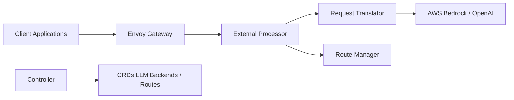

# envoyproxy/ai-gateway

> Plan de contrôle Envoy qui expose une API compatible OpenAI unique vers modèles hébergés, auto-hébergés et serveurs MCP, pour équipes plateforme.

## Le problème
Chaque application appelle son fournisseur de modèle avec ses propres clés, quotas et bascules ; les équipes plateforme n'ont pas de point central de contrôle.

## Ce que ça fait vraiment
Une API OpenAI-compatible devant plusieurs fournisseurs (Bedrock et OpenAI cités par le schéma). Les identifiants, le routage, les quotas, le failover et l'attribution des usages sont centralisés, appliqués par Envoy et Envoy Gateway. Modèle en deux niveaux : passerelle d'entrée (authentification, routage, limites globales) et passerelle vers le cluster de modèles auto-hébergés avec sélection d'endpoint. Renommé Agent Router ; CRDs et CLI `aigw` inchangés.

## Comment c'est branché


## Essayer
```bash
OPENAI_API_KEY=sk-your-key aigw run
# puis pointer un client OpenAI-compatible sur http://localhost:1975/v1
```

## Coût et pièges
Le mode local demande seulement une clé de fournisseur ; le déploiement complet suppose Kubernetes et Envoy Gateway. Les appels aux modèles restent facturés par les fournisseurs. 313 issues ouvertes.

## Ce que ce n'est pas
Pas un simple proxy de bureau : l'usage pertinent est sur Kubernetes. API v1alpha1 d'après le schéma, donc susceptible d'évoluer. Ce n'est pas un outil d'évaluation de modèles.

## Alternatives
Aucune alternative nommée dans le README.

## Pour toi
À surveiller : pertinent si tu opères une plateforme d'inférence multi-modèles sur Kubernetes ; pour un usage individuel, c'est surdimensionné.
