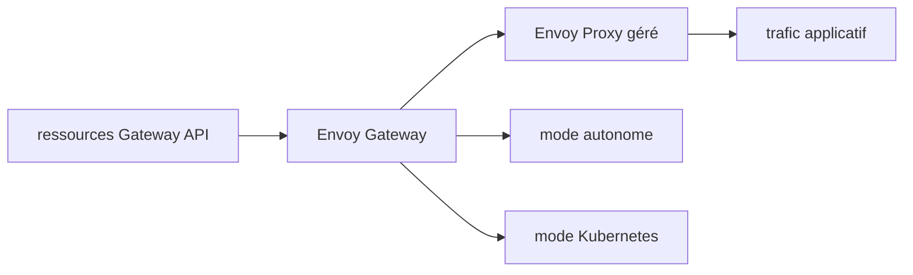

# envoyproxy/gateway

> Gestion d'Envoy Proxy comme passerelle applicative, autonome ou sur Kubernetes.

## Le problème
Configurer Envoy à la main pour servir de passerelle applicative est fastidieux et peu déclaratif.

## Ce que ça fait vraiment
Provisionne et configure dynamiquement les Envoy Proxies gérés à partir des ressources Gateway API.
Le README ne décrit rien d'autre : il renvoie au blog d'introduction, aux objectifs, au quickstart,
à la roadmap et à la matrice de compatibilité. Fiche minimale, matière insuffisante.

## Comment c'est branché

## Essayer
Aucune commande documentée dans le README : il pointe vers le quickstart externe.

## Coût et pièges
Gratuit. Rien n'est précisé sur les prérequis ni la version d'Envoy : la matrice de compatibilité
est externe. La licence n'est pas déclarée dans le README.

## Ce que ce n'est pas
Ce n'est pas la spécification Gateway API : c'est une implémentation qui la consomme.
Ce n'est pas un proxy : c'est le plan de contrôle d'Envoy. Le README ne suffit pas pour décider :
il faut aller lire les objectifs et la roadmap.

## Alternatives
Aucune nommée dans le README.

## Pour toi
À ne regarder que si tu opères une passerelle Kubernetes ; sinon rien à en tirer.
