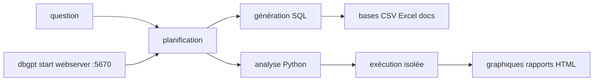

# eosphoros-ai/DB-GPT

> Assistant de données agentique : il se connecte à tes bases, écrit du SQL et produit des rapports.

## Le problème
Répondre à une question métier demande de trouver la table, écrire le SQL, nettoyer, tracer un graphique.
Chaque étape est simple, l'enchaînement est long, et il recommence à chaque nouvelle question.

## Ce que ça fait vraiment
Se connecte à des bases, fichiers CSV/Excel, entrepôts et bases de connaissances dans un même espace.
Planifie la tâche, écrit SQL et Python, exécute pas à pas et produit graphiques, tableaux de bord, rapports HTML.
L'exécution de code se fait dans des environnements isolés, avec des « skills » réutilisables par domaine.
Le serveur web écoute sur `http://localhost:5670` après un assistant de configuration au premier lancement.

## Comment c'est branché


## Essayer
```bash
uv pip install dbgpt-app
dbgpt start
```
Installateur en une ligne (à lire avant de l'exécuter, le README donne la variante `-o install.sh` + `less`) :
`curl -fsSL https://raw.githubusercontent.com/eosphoros-ai/DB-GPT/main/scripts/install/install.sh | OPENAI_API_KEY=sk-xxx bash -s -- --profile openai`.

## Coût et pièges
Python 3.10+ et une clé d'API chez OpenAI, Moonshot (Kimi) ou MiniMax selon le profil choisi.
Le chemin d'installation mis en avant est un `curl | bash` : lis le script, le README t'y invite lui-même.

## Ce que ce n'est pas
Pas un outil de BI figé : il génère des rapports, il ne remplace pas un modèle sémantique gouverné.
Pas sans risque sur tes bases : il écrit et exécute du SQL de façon autonome, à cadrer par des droits en lecture.
Pas entièrement local par défaut : le mode privé (modèles locaux, désensibilisation) est une configuration à part.

## Alternatives
Aucune nommée dans le README.

## Pour toi
À tester sur une réplique en lecture seule : l'idée est juste, l'autonomie SQL demande un garde-fou.
