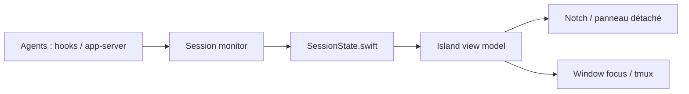

# erha19/ping-island

> Application macOS de barre de menus qui surveille les sessions d'agents de code et permet de répondre depuis le notch.

## Le problème
Avec plusieurs agents en parallèle, les demandes d'approbation ou de saisie passent inaperçues dans des onglets de terminal.

## Ce que ça fait vraiment
Reçoit les événements des hooks de Claude Code, Codex, Gemini CLI, Qwen, Kimi, OpenCode, Cursor, Copilot et d'autres, les normalise, et affiche une surface compacte qui se déploie quand une action est nécessaire. On peut approuver ou refuser des outils, répondre aux questions, revenir à la bonne fenêtre (iTerm2, Ghostty, tmux, IDE). Support d'hôtes SSH distants, thèmes, sons et mascottes personnalisables.

## Comment c'est branché


## Essayer
```bash
brew install --cask ping-island
xcodebuild -project PingIsland.xcodeproj -scheme PingIsland -configuration Release build
./scripts/test.sh
```

## Coût et pièges
Gratuit, macOS 14+. Demande les permissions Accessibilité et Apple Events pour la mise au point des fenêtres. Il installe des hooks dans les fichiers de configuration des agents (`~/.gemini/settings.json`, `~/.kimi/config.toml`, etc.).

## Ce que ce n'est pas
Pas un agent : il observe et relaie. Positionné comme alternative libre à Vibe Island ; le composant « Telemetry » apparaît dans le graphe mais le README n'en dit rien.

## Alternatives
- Vibe Island : produit de la même catégorie cité dans le README.
- claude-island : projet dont il reprend l'idée.

## Pour toi
À surveiller : confortable si tu fais tourner plusieurs agents sur Mac ; à tester avant de lui confier des approbations d'outils, vu qu'il peut les auto-approuver.

