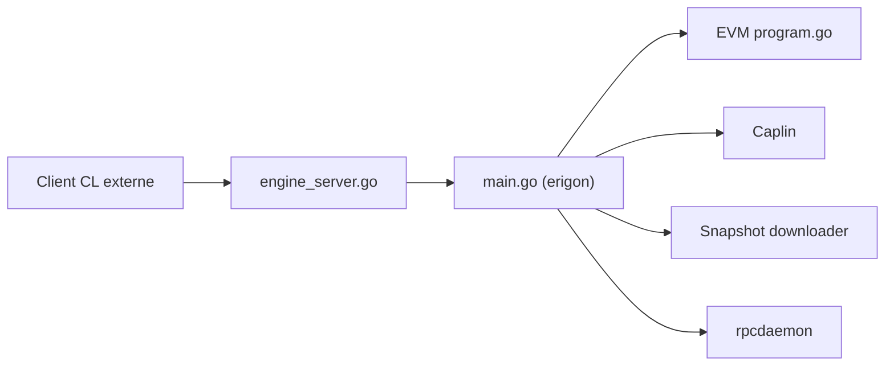

# erigontech/erigon

> Client Ethereum de couche exécution, optimisé en efficacité, avec consensus embarqué (Caplin).

## Le problème
Les nœuds Ethereum archive occupent énormément de disque et de temps de synchronisation.

## Ce que ça fait vraiment
Exécute l'EVM, stocke l'état et l'historique en fichiers immuables (snapshots), expose JSON-RPC, GraphQL et gRPC. Caplin, le consensus embarqué, est activé par défaut. Modes d'élagage : archive, full, blocks, minimal. Composants lançables séparément : rpcdaemon, sentry, txpool, downloader.

## Comment c'est branché


## Essayer
```sh
git clone https://github.com/erigontech/erigon.git
cd erigon
make erigon
```

## Coût et pièges
Gratuit. Go 1.26 et GCC 11+ ou Clang 13+ ; processeur x86-64-v2 minimum. Disque et RAM selon le mode (voir la documentation).

## Ce que ce n'est pas
Ce README s'adresse aux contributeurs ; l'exploitation d'un nœud est dans la doc externe. LGPL-3.0.

## Alternatives
Aucune citée dans le README.

## Pour toi
Utile pour de l'analyse de données on-chain seulement ; hors de ce cas, ignorer.

