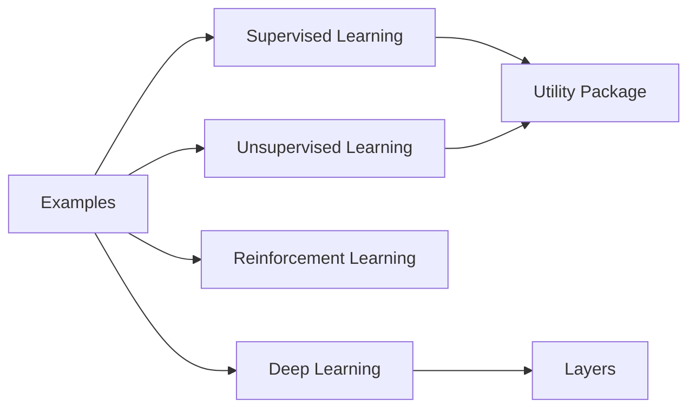

# eriklindernoren/ML-From-Scratch

> Implémentations NumPy lisibles des algorithmes de machine learning classiques, pour apprendre.

## Le problème
Les bibliothèques optimisées cachent le fonctionnement interne des algorithmes.

## Ce que ça fait vraiment
Code Python transparent, non optimisé, de ~50 algorithmes : régressions, arbres, boosting, XGBoost, SVM, k-means, DBSCAN, PCA, GAN, RBM, DQN, apriori.
Mini-framework de deep learning : couches (conv, dense, RNN, batchnorm…), activations, pertes, optimiseurs.
Scripts d'exemple dans `mlfromscratch/examples/`.

## Comment c'est branché


## Essayer
```bash
git clone https://github.com/eriklindernoren/ML-From-Scratch
cd ML-From-Scratch
python setup.py install
python mlfromscratch/examples/polynomial_regression.py
```

## Coût et pièges
Gratuit, CPU. Dernier push en octobre 2023 ; `setup.py install` est une méthode dépréciée.

## Ce que ce n'est pas
Pas une bibliothèque à utiliser en production : ni performance ni API stable. Pas de tests ni de doc au-delà du README.

## Alternatives
Aucune alternative nommée dans le README.

## Pour toi
Excellente ressource pour réviser un algorithme avant un entretien ; rien à déployer.
