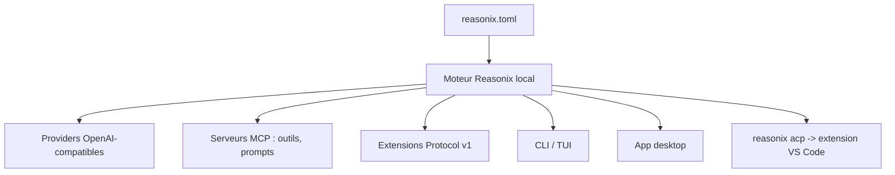

# esengine/DeepSeek-Reasonix

> Agent de codage en binaire unique, piloté par configuration, avec CLI, desktop et extension VS Code.

## Le problème
Les agents de codage arrivent liés à un modèle et à un éditeur, et il faut installer une pile complète pour les essayer.
Changer de fournisseur veut dire changer d'outil, pas changer une ligne de configuration.

## Ce que ça fait vraiment
Tout est déclaré dans `reasonix.toml` : fournisseurs, agent, outils activés, plugins. Aucun modèle codé en dur.
DeepSeek est un préréglage, mais tout endpoint compatible OpenAI est une entrée de configuration ; on peut faire tourner deux modèles ensemble (exécuteur + planificateur) en sessions séparées à cache stable.
Les serveurs MCP apportent outils, prompts et ressources ; des sidecars « Extension Protocol v1 » interceptent les événements d'exécution et fournissent des Providers et de l'UI structurée.
Maintenance du contexte : injection au démarrage d'un résumé d'environnement stable, élagage des sorties d'outils périmées avant compaction.

## Comment c'est branché


## Essayer
```sh
npm i -g reasonix
reasonix setup
reasonix run "implement the TODOs in main.go"
```

## Coût et pièges
Licence MIT, binaire statique `CGO_ENABLED=0` : rien à installer sur la machine cible. Les appels au modèle restent à votre charge.
Compilation depuis les sources : Go 1.26+ pour la CLI, Node 24+ et pnpm 10 en plus pour le desktop.

## Ce que ce n'est pas
Ce n'est pas lié à DeepSeek malgré le nom du dépôt : DeepSeek n'est qu'un préréglage parmi d'autres.
L'extension VS Code n'embarque pas la CLI : il faut installer le binaire d'abord.
Projet communautaire à contributeurs nombreux mais jeune ; les dons annoncés « n'achètent ni priorité ni triage ».

## Alternatives
Aucun agent concurrent n'est nommé dans le README.

## Pour toi
À surveiller si tu veux un agent de codage local dont le fournisseur de modèle est une ligne de config.
