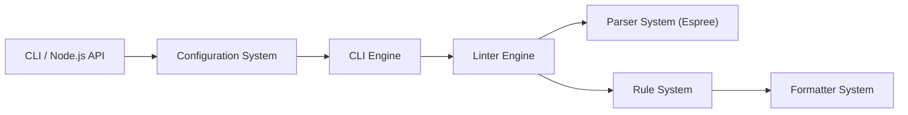

# eslint/eslint

> Linter JavaScript pluggable qui repère des motifs problématiques dans le code via son arbre syntaxique.

## Le problème
Les erreurs de style et de logique en JavaScript passent à la relecture ; il faut une vérification automatique et configurable.

## Ce que ça fait vraiment
Analyse le code avec le parseur Espree, évalue des règles sur l'AST (chaque règle est un plugin) et signale ou corrige automatiquement. Configuration dans `eslint.config.js` avec niveaux off, warn, error. Des plugins et parseurs (Babel, TypeScript) étendent la couverture. Versions semver avec une politique précisée : une mise à jour mineure peut faire apparaître de nouvelles erreurs.

## Comment c'est branché


## Essayer
```bash
npm init @eslint/config@latest
npx eslint yourfile.js
```

## Coût et pièges
Gratuit. Node ^20.19.0, ^22.13.0 ou >=24 requis. Le README recommande un `~` dans `package.json` pour figer les résultats de lint. Avec pnpm, réglages `.npmrc` conseillés.

## Ce que ce n'est pas
Ce n'est pas un formateur : le README précise que Prettier a un rôle différent et qu'on utilise souvent les deux. Il ne supporte officiellement que le dernier standard ECMAScript.

## Alternatives
- JSLint et JSHint : cités comme outils similaires ; ESLint est plus pluggable.
- Prettier : à associer, pas à opposer.

## Pour toi
Surveiller : indispensable si tu écris du front ou des outils Node, sans intérêt direct pour un travail centré Python.

