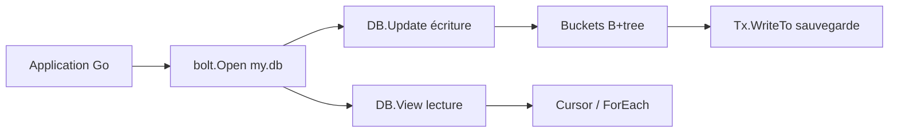

# etcd-io/bbolt

> Base clé/valeur embarquée en Go pur, fichier unique, transactions ACID sérialisables.

## Le problème
Stocker un état local durable sans monter un Postgres : les alternatives soit imposent un serveur,
soit n'offrent pas de transaction, soit tombent en désuétude comme le Bolt d'origine.

## Ce que ça fait vraiment
Fork maintenu de Bolt, inspiré de LMDB. Une base est un **fichier unique** verrouillé par un seul
processus. `DB.Update` ouvre une transaction en écriture (une seule à la fois), `DB.View` autant de
lectures concurrentes qu'on veut, `DB.Batch` regroupe les écritures concurrentes. Les données vivent
dans des buckets, éventuellement imbriqués, parcourus par `Cursor` (`First`, `Seek`, `Next`), scans de
préfixe ou de plage. `Tx.WriteTo` fait une sauvegarde à chaud depuis une transaction de lecture.

## Comment c'est branché


## Essayer
```sh
go get go.etcd.io/bbolt@latest
go run go.etcd.io/bbolt/cmd/bbolt@latest
go install go.etcd.io/bbolt/cmd/bbolt@latest
```

## Coût et pièges
Gratuit. Un seul processus peut ouvrir la base : une seconde ouverture **bloque** jusqu'à fermeture,
sauf `Options{Timeout}`. Les transactions imbriquées ou simultanées dans une même goroutine peuvent
provoquer un interblocage. Les valeurs renvoyées ne sont valides que pendant la transaction : les
utiliser après provoque un panic `unexpected fault address` ; il faut `copy()`.

## Ce que ce n'est pas
Pas une base relationnelle : accès par clé seulement, aucune jointure, aucun SQL.
Pas un serveur : accès multi-processus impossible. Mauvais choix pour de l'écriture aléatoire intensive
(>10 000 écritures/s) ou des disques mécaniques. Éviter les transactions de lecture longues, qui
empêchent la récupération des pages. README tronqué à la source en fin de section « Caveats ».

## Alternatives
- **LevelDB / RocksDB** : LSM-tree, meilleur en écriture aléatoire, mais sans transactions.
- **LMDB** : ancêtre architectural, plus rapide, au prix d'opérations non sûres.
- **SQLite** : embarqué comme bbolt, mais avec SQL et son surcoût d'analyse et de planification.

## Pour toi
Le bon réflexe pour un cache ou un état local dans un service Go ; sans intérêt côté Python.
