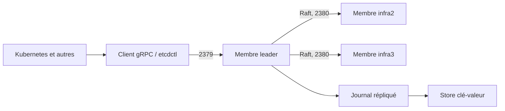

# etcd-io/etcd

> Magasin clé-valeur distribué et fiable, pour les données critiques d'un système réparti.

## Le problème
Coordonner plusieurs nœuds — élection de leader, verrous, configuration partagée — sans magasin cohérent finit toujours en incohérences silencieuses.

## Ce que ça fait vraiment
Un magasin clé-valeur répliqué avec une API gRPC bien définie, TLS automatique et authentification optionnelle par certificat client, mesuré à 10 000 écritures/seconde. Écrit en Go, il utilise l'algorithme de consensus Raft pour gérer un journal répliqué hautement disponible. Un client en ligne de commande, `etcdctl`, couvre l'usage courant. Des tests de robustesse rigoureux complètent la validation ; etcd est utilisé en production notamment par Kubernetes.

## Comment c'est branché


## Essayer
```bash
etcd
etcdctl put mykey "this is awesome"
etcdctl get mykey
goreman start
go get go.etcd.io/etcd/client/v3
```

## Coût et pièges
Gratuit. La branche `main` peut être instable, voire cassée, pendant le développement : n'utiliser que les versions publiées. Deux ports officiels : 2379 pour les clients, 2380 entre pairs. Un cluster local de test demande `goreman`.

## Ce que ce n'est pas
Ce n'est pas une base de données généraliste : c'est fait pour les données critiques et peu volumineuses de coordination, pas pour du stockage applicatif. Le README ne documente ni le dimensionnement, ni la rétention, ni la sauvegarde : tout est dans le guide d'exploitation.

## Alternatives
Aucune alternative nommée dans le README.

## Pour toi
À adopter par la bande : si tu opères du Kubernetes, tu l'exploites déjà — connaître `etcdctl` et les deux ports est le minimum vital.
