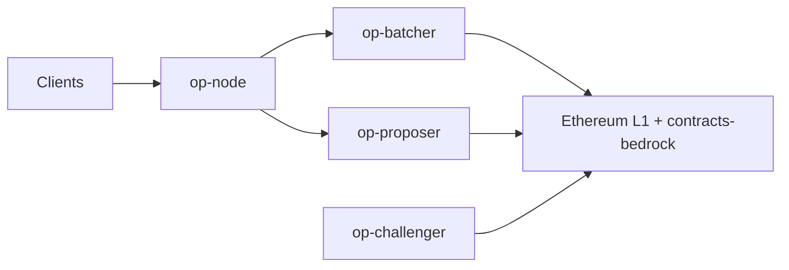

# ethereum-optimism/optimism

> Monorepo de l'OP Stack, la pile logicielle des blockchains L2 Optimism et Base, pour opérateurs de rollups.

## Le problème
Ethereum L1 est cher et lent ; les rollups déplacent l'exécution hors chaîne en gardant la sécurité de L1.

## Ce que ça fait vraiment
Regroupe les composants : `op-node` (client de consensus du rollup), `op-batcher` (soumet les lots à L1), `op-proposer`, `op-challenger` (jeux de litige), `cannon` (émulateur MIPS pour preuves de fraude), les contrats `contracts-bedrock`, et des composants Rust (kona, op-reth). Seuls quelques composants ont des versions de production.

## Comment c'est branché


## Essayer
```bash
curl -L https://github.com/ethereum-optimism/optimism/archive/$REF.tar.gz | tar xz
git clone --depth 1 --shallow-submodules https://github.com/ethereum-optimism/optimism.git
```

## Coût et pièges
Historique git de plusieurs Go ; les changements de contrats ne sont pas rétrocompatibles. Exploiter un rollup demande une infrastructure lourde. Programme de bug bounty jusqu'à 2 000 042 $.

## Ce que ce n'est pas
Pas un outil de data science ; le README ne donne pas de guide de démarrage, il renvoie aux docs.

## Alternatives
Aucune nommée dans le README.

## Pour toi
À ignorer : infrastructure blockchain sans rapport avec ton métier data/IA.

