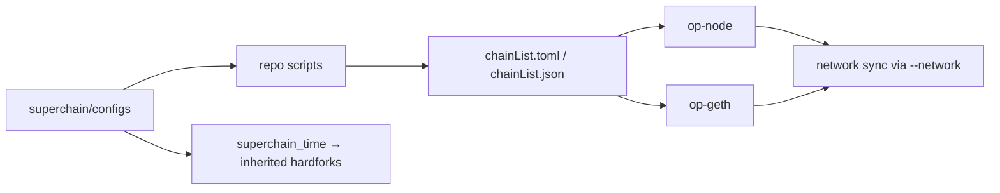

# ethereum-optimism/superchain-registry

> **One sentence.** The reference index of the chains in the Superchain ecosystem and of the configuration changes they made.

## The problem

Without this index there is no single place stating which chains belong to the Superchain
ecosystem, nor what modifications they applied to their own chain. Every downstream piece of
software would have to carry its own list, and those lists would drift apart.

## What it actually does

The repository hosts Superchain configuration data in a minimal, human-readable form: the
mainnet and testnet Superchain targets and their member chains. Per-chain configuration lives
in `superchain/configs`. Two top-level files, `chainList.toml` and `chainList.json`, are
autogenerated by scripts in the registry and are stated to remain stable to build against.
The README is explicit that other configuration — contract permissions and `SystemConfig`
parameters — is not here: it is hosted and governed onchain. A glossary sits in
`docs/glossary.md`. The repo also carries hardfork activation inheritance: a chain whose
`superchain_time` is set receives Superchain-wide coordinated hardforks automatically.

## How it is wired



No code-derived diagram exists for this repository; this one is rebuilt from the README,
which names `superchain/configs`, `chainList.toml`, `chainList.json`, `docs/ops.md`,
`docs/glossary.md` and `docs/hardfork-activation-inheritance.md`. The configs are embedded in
downstream OP-Stack software (`op-node` and `op-geth`); once the downstream dependency is
updated, an `op-node` instance can be started with the `--network` flag and an `op-geth`
instance with `--op-network`, and it will sync with other nodes on that network.

## Trying it

```
# no command is documented in the README
```

The README contains no command line at all. It points to `CHAINS.md` for the list of chains,
`superchain/configs` for detailed per-chain config, and `docs/ops.md#adding-a-chain` for the
procedure to add a chain. Nothing is reconstructed here.

## Cost and gotchas

The repository is free and MIT licensed; reading or cloning it costs nothing. The catch is
elsewhere: since March 1st, 2025, any standard chain wishing to be added to the registry
**must** have been deployed using OP Deployer, so adding a chain is not a plain data pull
request. Hardfork inheritance additionally requires the `superchain_time` value to be present
on `main` well in advance of the testnet and then mainnet release of `op-geth` and `op-node`,
and the chain's nodes to be started with the network flags — miss that window and you miss
the coordinated hardfork.

## What it is not

It is not software: nothing to install, nothing to run — it is a data index that other
binaries embed. It is also not the source of truth for everything about a chain: contract
permissions and `SystemConfig` parameters are governed onchain, not here. And being listed is
not a unilateral decision: it is gated on a mandated deployment tool and a documented process.

## Alternatives

The README names complementary pieces, not competitors: `ethereum-optimism/optimism`
(`op-node`) and `ethereum-optimism/op-geth` are the downstream consumers of these configs,
and OP Deployer is the deployment tool required upstream. No neighbours were supplied for
this repository, so: no comparable alternative in the catalogue.

## Why it matters to you

Of no direct use to a data / AI / MLOps profile, unless you index or analyse OP-Stack chain
data — in which case `chainList.json`, advertised as stable, is a clean versioned source to
consume directly. Otherwise, skip it.
