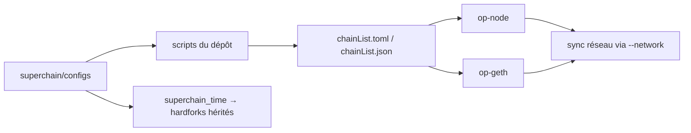

# ethereum-optimism/superchain-registry

> **Une phrase.** L'index de référence des chaînes de l'écosystème Superchain et de leurs configurations, sous forme de fichiers versionnés.

## Le problème

Sans cet index, il n'existe pas de source unique disant quelles chaînes font partie de
l'écosystème Superchain ni quelles modifications elles ont apportées à leur configuration.
Chaque logiciel aval devrait alors embarquer sa propre liste, avec le risque de divergence.

## Ce que ça fait vraiment

Le dépôt héberge les données de configuration Superchain sous une forme minimale et lisible
par un humain : les cibles mainnet et testnet, et leurs chaînes membres. Les configurations
détaillées par chaîne vivent dans `superchain/configs`. Deux fichiers de niveau racine,
`chainList.toml` et `chainList.json`, sont générés par des scripts du dépôt et annoncés
comme stables pour être consommés par des tiers. Le README précise que d'autres
configurations — permissions de contrats, paramètres `SystemConfig` — ne sont **pas** ici :
elles sont hébergées et gouvernées onchain. Un glossaire est fourni dans `docs/glossary.md`.
Le dépôt porte aussi le mécanisme d'héritage des activations de hardforks : une chaîne dont
le `superchain_time` est renseigné reçoit automatiquement les hardforks coordonnés à
l'échelle de la Superchain.

## Comment c'est branché



Aucun diagramme tiré du code n'existe pour ce dépôt : ce schéma est reconstruit depuis le
README, qui nomme `superchain/configs`, `chainList.toml`, `chainList.json`, `docs/ops.md`,
`docs/glossary.md` et `docs/hardfork-activation-inheritance.md`. Les configs sont embarquées
dans les logiciels OP-Stack aval (`op-node` et `op-geth`) ; une fois la dépendance mise à
jour côté aval, on peut démarrer un `op-node` avec le drapeau `--network` et un `op-geth`
avec `--op-network`, et la synchronisation avec les autres nœuds du réseau fonctionne.

## Essayer

```
# aucune commande n'est documentée dans le README
```

Le README ne donne aucune ligne de commande : il renvoie vers `CHAINS.md` pour la liste des
chaînes, `superchain/configs` pour les configs détaillées, et `docs/ops.md#adding-a-chain`
pour la procédure d'ajout d'une chaîne. Rien n'est reconstruit ici.

## Coût et pièges

Le dépôt est gratuit et sous licence MIT ; le consulter ou le cloner ne demande rien.
Le piège est ailleurs : depuis le 1er mars 2025, toute chaîne standard qui veut être ajoutée
au registre **doit** avoir été déployée avec OP Deployer — ajouter une chaîne n'est donc pas
un simple pull request de données. L'héritage des hardforks impose en plus que la valeur
`superchain_time` soit présente sur `main` bien en amont de la publication testnet puis
mainnet d'`op-geth` et `op-node`, et que les nœuds soient démarrés avec les drapeaux réseau :
rater cette fenêtre, c'est rater le hardfork coordonné.

## Ce que ce n'est pas

Ce n'est pas un logiciel : rien à installer, rien à exécuter, c'est un index de données que
d'autres binaires embarquent. Ce n'est pas non plus la source de toutes les configurations
d'une chaîne — le README indique explicitement que les permissions de contrats et les
paramètres `SystemConfig` sont gouvernés onchain, pas ici. Enfin, y figurer ne se décide pas
unilatéralement : c'est conditionné à un outil de déploiement imposé et à une procédure.

## Alternatives

Le README ne nomme que des briques complémentaires, pas des concurrents :
`ethereum-optimism/optimism` (`op-node`) et `ethereum-optimism/op-geth` sont les
consommateurs aval de ces configs, OP Deployer l'outil de déploiement exigé en amont.
Aucun voisin n'a été fourni pour ce dépôt : aucune alternative comparable dans le catalogue.

## Pour toi

Sans intérêt direct pour un profil data / IA / MLOps, sauf si tu indexes ou analyses des
données de chaînes OP-Stack : dans ce cas `chainList.json`, annoncé comme stable, est une
source propre et versionnée à consommer directement. Sinon, passe ton chemin.
