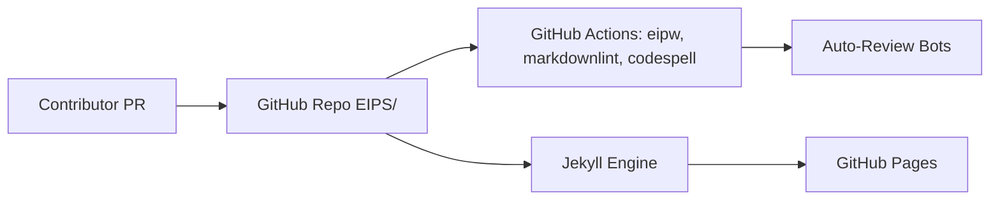

# ethereum/EIPs

> Dépôt des propositions d'amélioration d'Ethereum (EIP), lu par les développeurs du protocole.

## Le problème
Un protocole décentralisé a besoin d'un processus public et versionné pour proposer, discuter et figer ses évolutions.

## Ce que ça fait vraiment
Contient les EIP en Markdown, classées en Core, Networking, Interface, Meta, Informational. Les ERC ont été déplacées vers ethereum/ercs. Les PR passent par `eipw`, HTMLProofer, CodeSpell, markdownlint et un bot de fusion automatique. Jekyll génère le site publié via GitHub Pages.

## Comment c'est branché


## Essayer
```bash
cargo install eipw
eipw --config ./config/eipw.toml <INPUT FILE / DIRECTORY>
bundle install
bundle exec jekyll serve
```

## Coût et pièges
Gratuit. Le build local exige Ruby 3.1.4 exactement (versions ultérieures non supportées). Toute idée doit d'abord être discutée sur Ethereum Magicians ou Research.

## Ce que ce n'est pas
Pas un lieu d'aide à l'implémentation ni de questions techniques ; pas de code exécutable.

## Alternatives
Aucune alternative citée dans le README.

## Pour toi
À surveiller : référence utile si tu touches à la blockchain, sans intérêt direct pour un pipeline data/ML classique.

