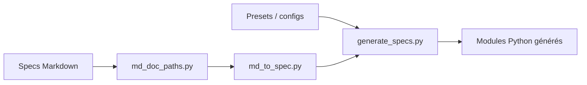

# ethereum/consensus-specs

> Spécifications de la couche consensus d'Ethereum en preuve d'enjeu, pour les développeurs de clients.

## Le problème
Plusieurs équipes implémentent le même protocole : sans texte de référence exécutable, les clients divergent.

## Ce que ça fait vraiment
Héberge les specs par mise à jour (Phase0 à Fulu, Gloas et Heze encore instables), écrites en Markdown. Un générateur Python transforme ces documents et des presets en modules Python par fork. Le README cite aussi des visualiseurs en ligne et des tests de référence (publication non cartographiée).

## Comment c'est branché

## Essayer
Aucune commande documentée dans le README. Lecture en ligne : https://ethereum.github.io/consensus-specs/

## Coût et pièges
Gratuit. Les specs évoluent par fork ; les forks « unstable » (Gloas, Heze) n'ont pas d'epoch fixé.

## Ce que ce n'est pas
Ce n'est pas un client Ethereum : il ne se lance pas comme nœud. Licence CC0 : aucune contrainte.

## Alternatives
Prysm et Erigon (clients) implémentent ces specs ; ils ne les remplacent pas.

## Pour toi
Utile seulement si tu travailles sur Ethereum ; hors de ce domaine, sans intérêt pour un profil data/IA : ignorer.

