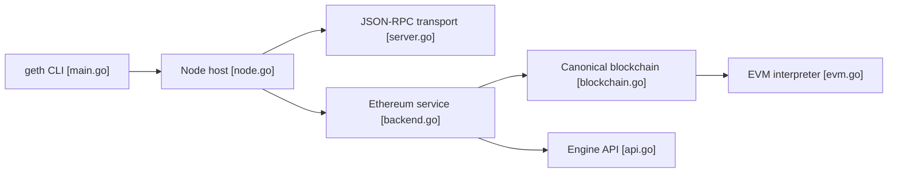

# ethereum/go-ethereum

> Client Ethereum en Go (couche d'exécution) pour faire tourner un nœud et exposer des API JSON-RPC.

## Le problème
Interagir avec Ethereum (comptes, transferts, contrats) suppose de rejoindre le réseau pair à pair avec un nœud qui valide et exécute les blocs.

## Ce que ça fait vraiment
`geth` synchronise la chaîne (mode snap par défaut), valide et exécute les blocs, maintient l'état (arbres de Merkle Patricia), gère le pool de transactions et parle au client de consensus via l'Engine API. Il sert du JSON-RPC (HTTP, WebSocket, IPC) et du GraphQL en option. D'autres exécutables : `abigen`, `evm`, `devp2p`, `rlpdump`.

## Comment c'est branché


## Essayer
```bash
make geth
make all
geth console
geth --sepolia console
docker run -d --name ethereum-node -v /Users/alice/ethereum:/root -p 8545:8545 -p 30303:30303 ethereum/client-go
```

## Coût et pièges
Minimum : 4 cœurs, 8 Go de RAM, SSD de 2 To, 8 Mbit/s. Depuis la fusion (Merge), un client de consensus (beacon) est indispensable. N'ouvre jamais HTTP/WS sans réfléchir : le README avertit d'attaques actives sur les API exposées. Incohérence : le README demande Go 1.25, la description d'architecture dit 1.23.

## Ce que ce n'est pas
Ce n'est pas un client complet à lui seul, ni un outil d'analytique on-chain. Le réseau privé n'est plus simple à monter.

## Alternatives
Aucune alternative nommée dans le README (Kurtosis et le mode Dev servent aux réseaux de test).

## Pour toi
À ignorer sauf projet de données on-chain : 2 To de disque et un client de consensus pour un besoin hors data/IA classique.

