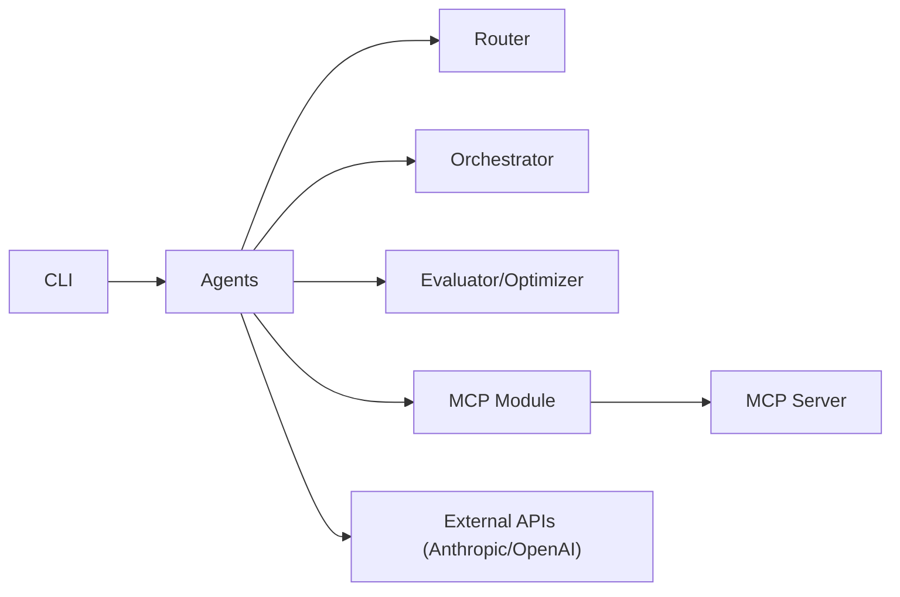

# evalstate/fast-agent

> Cadre Python et CLI pour composer des agents et workflows reliés à des serveurs MCP.

## Le problème
Brancher des LLM sur des serveurs MCP, avec chaînes d'agents, routage et validation humaine, exige beaucoup de code de liaison.

## Ce que ça fait vraiment
On déclare des agents par décorateurs (`@fast.agent`) et on les combine : `chain`, `parallel`, `evaluator_optimizer`, `router`, `orchestrator`, `maker` (vote k) et « agents comme outils ». Les serveurs MCP sont déclarés dans `fast-agent.yaml`, avec OAuth (PKCE, trousseau système) et diagnostic du transport HTTP. Il prend en charge Anthropic, OpenAI, Google, Azure, Ollama, DeepSeek. Des skills (`SKILL.md`), un mode shell et un mode serveur MCP sont inclus.

## Comment c'est branché


## Essayer
```bash
uvx fast-agent-mcp@latest -x
uv tool install -U fast-agent-mcp
fast-agent go
fast-agent scaffold
fast-agent quickstart workflow
uv run agent.py --model sonnet
```

## Coût et pièges
Les appels au LLM sont à ta charge (clé du fournisseur). Sans modèle configuré, une session interactive ouvre un sélecteur ; les exécutions automatisées exigent `--model` ou `FAST_AGENT_MODEL`. La description d'architecture cite encore `src/mcp_agent`, trace de la filiation avec mcp-agent.

## Ce que ce n'est pas
Ce n'est pas un produit fini pour utilisateurs non techniques : c'est un cadre de développeur. Les affirmations « premier cadre au support MCP complet » et « seul outil qui inspecte le transport HTTP » sont celles de l'auteur, sans preuve.

## Alternatives
- mcp-agent : projet dont fast-agent s'inspire et dont il dérive.
- OpenAI Agents SDK : source d'inspiration du motif « agents comme outils ».

## Pour toi
À surveiller : couvre bien les workflows d'agents MCP, mais à mainteneur unique et avec un chevauchement important avec d'autres cadres ; essaie-le sur un cas MCP précis avant de l'adopter.
