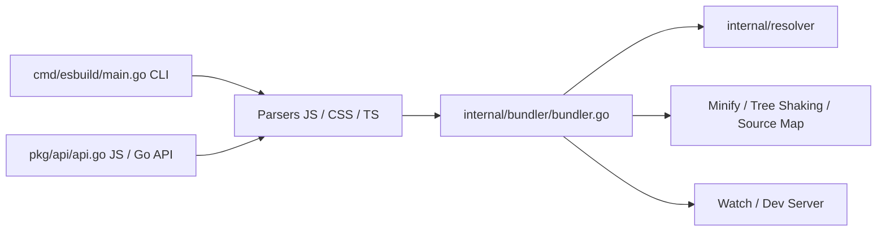

# evanw/esbuild

> Bundler JavaScript, CSS, TypeScript et JSX écrit en Go, très rapide, pour développeurs web.

## Le problème
Les outils de build web sont, selon le README, 10 à 100 fois plus lents qu'ils pourraient l'être.

## Ce que ça fait vraiment
README minimal (moins de 800 caractères). Il annonce : bundling de modules ESM et CommonJS, CSS et modules CSS, tree shaking, minification, source maps, serveur local, mode watch, plugins, avec API en ligne de commande, JS et Go. D'après l'architecture : analyseurs JS/CSS/TS, graphe de modules, résolveur de dépendances, étapes de transformation, cache, watch et serveur de dev.

## Comment c'est branché


## Essayer
```bash
# Aucune commande documentée dans le README ; renvoi aux instructions de démarrage du site
```

## Coût et pièges
Gratuit (MIT). Le README ne détaille ni installation ni options : tout est renvoyé à la documentation externe.

## Ce que ce n'est pas
Pas un vérificateur de types TypeScript, pas un framework : un outil de build.

## Alternatives
- Aucune alternative nommée dans le README.

## Pour toi
Ignorer : un bundler front-end n'intervient pas dans un flux data/IA/MLOps, sauf si tu construis une interface web.

