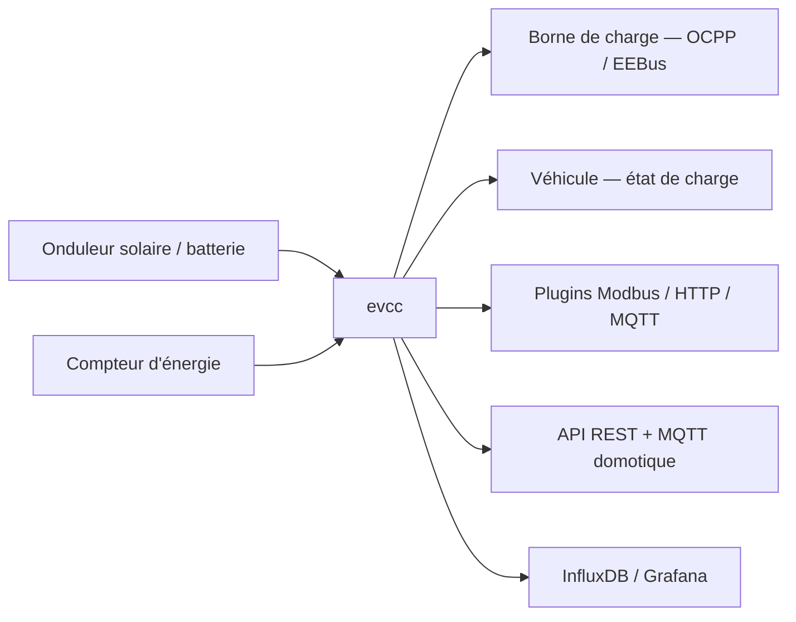

# evcc-io/evcc

> Contrôleur de charge de véhicule électrique et gestion d'énergie domestique, sans cloud.

## Le problème
Charger sa voiture sur son propre solaire suppose de faire parler entre eux une borne, un
onduleur, un compteur et le véhicule — chacun avec son protocole, et souvent via un cloud
constructeur qui peut disparaître.

## Ce que ça fait vraiment
Pilote la charge en fonction de la production locale et de la consommation de la maison, avec une
interface web simple. La force du projet est la couverture matérielle : plus d'une centaine de
bornes (EEBus et OCPP inclus, plus des montages DIY Phoenix Contact et EVSE DIN), prises
connectées, pompes à chaleur et chauffages électriques, onduleurs solaires et batteries,
compteurs d'énergie généralistes, appareils SunSpec et mbmd, et l'état de charge de la plupart
des marques de véhicules. Ce qui n'est pas couvert se branche par plugin : Modbus, HTTP, MQTT,
JavaScript, WebSocket, Go ou script shell. Notifications Telegram ou PushOver, journalisation
InfluxDB et Grafana, API REST et MQTT pour la domotique.

## Comment c'est branché


## Essayer
```bash
# Aucune commande documentée dans le README : il renvoie entièrement à la documentation
# du projet pour l'installation et la configuration.
```

## Coût et pièges
Le logiciel est gratuit ; tout le coût est matériel. Les intégrations véhicule passent souvent par
les services constructeurs malgré l'objectif « sans cloud », et le README ne dit pas lesquelles.
Les extensions Home Assistant et openHAB ne sont **pas maintenues par l'équipe cœur**.

## Ce que ce n'est pas
Ce n'est pas un pilote universel garanti : une marque listée ne veut pas dire tous ses modèles.
Ce n'est pas une solution clé en main — la configuration se fait en YAML, hors README.

## Alternatives
Aucune alternative nommée dans le README ; openWB et Home Assistant apparaissent comme
matériels ou extensions supportés, pas comme concurrents.

## Pour toi
Projet domestique, sans rapport avec un usage professionnel data ou IA.
