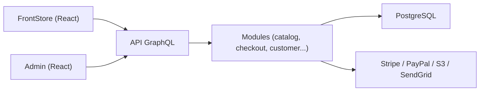

# evershopcommerce/evershop

> Plateforme e-commerce en TypeScript, GraphQL et React, modulaire et personnalisable par les développeurs.

## Le problème
Monter une boutique en ligne sur mesure demande de réassembler catalogue, panier, paiement et administration.

## Ce que ça fait vraiment
Un monorepo de modules (catalogue, panier, clients, CMS, promotions, taxes, commandes) exposés par une API GraphQL unifiée, avec deux clients React (vitrine et administration) et une base PostgreSQL. Des paquets branchent PayPal, Stripe, paiement à la livraison, stockage S3/Azure, envoi de courriel (Resend, SendGrid) et connexion Google.

## Comment c'est branché


## Essayer
```bash
curl -sSL https://raw.githubusercontent.com/evershopcommerce/evershop/main/docker-compose.yml > docker-compose.yml
docker compose up -d
```

## Coût et pièges
Docker requis ; les services tiers (paiement, courriel, stockage) ont leurs comptes et frais propres. Le README annonce un futur « EverShop Cloud » et cherche des investisseurs.

## Ce que ce n'est pas
Pas un outil data/IA. La GPL-3.0 impose le copyleft si tu redistribues une version modifiée. Un compte de démonstration public est indiqué dans le README.

## Alternatives
Aucune alternative nommée dans le README.

## Pour toi
À ignorer : plateforme de vente en ligne sans lien avec un travail data/IA, sauf projet e-commerce précis.

