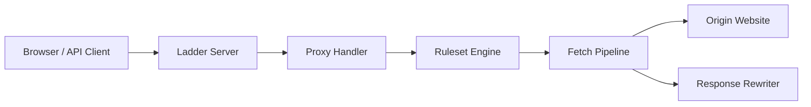

# everywall/ladder

> Proxy HTTP en Go pour tester comment un site sert son contenu selon le type de client.

## Le problème
Déboguer les en-têtes, règles d'accès et comportements de paywall demande de simuler différents navigateurs et robots.

## Ce que ça fait vraiment
Serveur Fiber : une URL saisie (formulaire, `/api/…` ou `/raw/…`) passe par l'authentification optionnelle, la correspondance de règles de domaine, la modification de la requête, puis la récupération sur le site d'origine. La réponse est réécrite (en-têtes, CSP, code injecté) et renvoyée en HTML, HTML brut ou données d'API. Les règles viennent de YAML local ou distant ; FlareSolverr est un composant externe optionnel.

## Comment c'est branché


## Essayer
```bash
docker run -p 8080:8080 -d --env RULESET=https://raw.githubusercontent.com/everywall/ladder-rules/main/ruleset.yaml --name ladder ghcr.io/everywall/ladder:latest
curl -X GET "http://localhost:8080/api/https://www.example.com"
```

## Coût et pièges
Gratuit. Si l'instance est publique, activer Basic Auth (`USERPASS`) : sinon n'importe qui peut s'en servir et le responsable est l'hébergeur, avertit le README. Le mode Windows est « non testé ».

## Ce que ce n'est pas
Le README le cadre comme outil de test et de recherche, à utiliser dans le respect des lois et des conditions d'utilisation des sites ; il ne contourne pas les protections anti-automatisation avancées. L'intégration FlareSolverr est optionnelle et son usage relève de la responsabilité de l'utilisateur. Licence GPL-3.0.

## Alternatives
Aucune alternative nommée dans le README.

## Pour toi
À ignorer : usage centré sur l'accès aux contenus de sites tiers, à risque juridique, sans apport pour un travail data/IA/MLOps.

