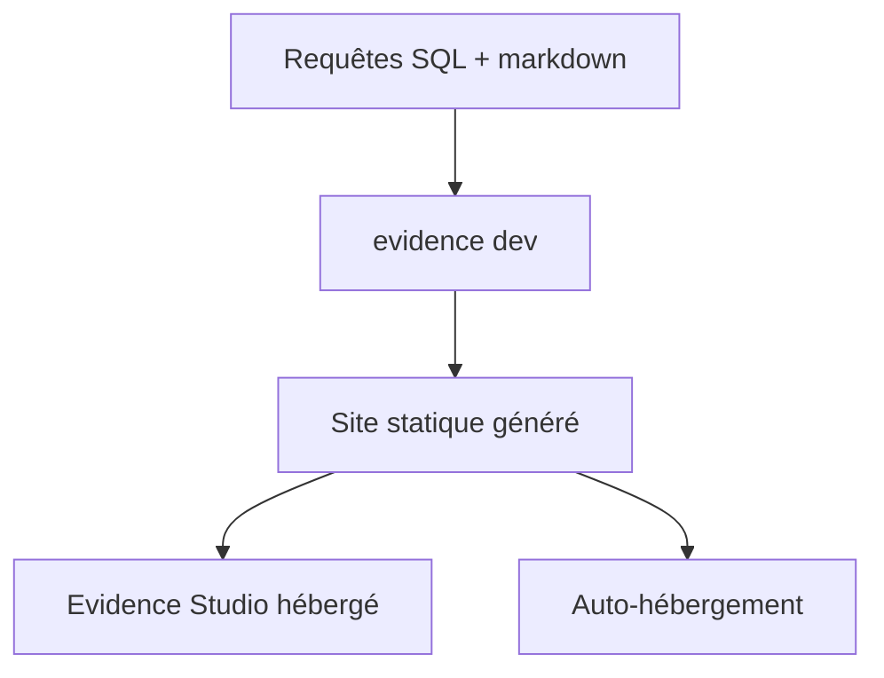

# evidence-dev/evidence

> Outil open source pour créer des rapports data en SQL et markdown, alternative au BI drag-and-drop.

## Le problème
Les outils BI par glisser-déposer sont difficiles à versionner, à revoir et à automatiser. Écrire un rapport data en code manque d'un cadre prêt à l'emploi.

## Ce que ça fait vraiment
Rapports écrits en SQL + markdown. Développement via l'agent Evidence ou en local avec Claude Code / Cursor. Auto-hébergement ou publication sur Evidence Studio (site statique généré). CLI `evidence init` / `evidence dev`.

## Comment c'est branché


## Essayer
```bash
curl -fsSL https://evidence.studio/install.sh | sh
evidence help
```
```bash
evidence init my-project
cd my-project
evidence dev
```

## Coût et pièges
Cœur gratuit ; Evidence Studio est l'offre hébergée payante. README très court : peu de détail sur les sources de données supportées.

## Ce que ce n'est pas
Pas un outil no-code : il faut écrire du SQL. README minimal, matière insuffisante pour juger la profondeur.

## Alternatives
Non nommées dans le README.

## Pour toi
Attrayant pour un data scientist qui veut des rapports versionnés et « as-code » plutôt qu'un dashboard cliquable ; à évaluer sur pièces.
