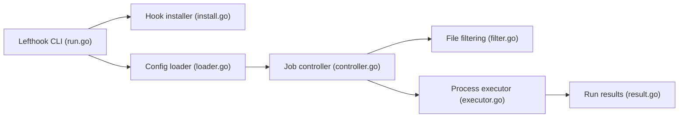

# evilmartians/lefthook

> Gestionnaire de hooks Git en Go, binaire unique, pour projets Node, Ruby, Python et autres.

## Le problème
Lancer lint et tests avant commit ou push, sur les seuls fichiers concernés, sans scripts maison ni dépendances lourdes.

## Ce que ça fait vraiment
Lit `lefthook.yml`, installe les scripts de hooks Git, puis exécute des jobs avec filtres (glob, regex, `{staged_files}`), en parallèle, par sous-dossier, par tags, via scripts ou Docker. Config locale, exécution manuelle d'un groupe (`lefthook run`), sortie réglable. Le code montre aussi un installateur de hooks pour assistants IA et une mise à jour automatique.

## Comment c'est branché


## Essayer
```bash
npm install lefthook --save-dev
vim lefthook.yml
lefthook install
lefthook run pre-commit
```

## Coût et pièges
Gratuit. Hooks contournables (`--no-verify` côté Git, non décrit ici). Cette liste d'installations (Go 1.26, npm, gem, pipx) montre qu'on choisit son gestionnaire.

## Ce que ce n'est pas
Pas un outil de lint : il orchestre les tiens.

## Alternatives
Aucune nommée dans le README.

## Pour toi
À adopter : un `lefthook.yml` unique pour ruff, tests rapides et contrôle de secrets dans un dépôt MLOps polyglotte.

