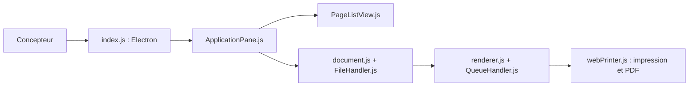

# evolus/pencil

> Outil de prototypage d'interfaces et de maquettes de bureau, en cours de réécriture sur Electron.

## Le problème
Dessiner des maquettes d'interface demande souvent un outil en ligne ou propriétaire.

## Ce que ça fait vraiment
Application de maquettage : pages, formes, collections de formes, impression et export PDF. La version 3 migre de Mozilla XULRunner vers Electron, avec un format de fichier zip, des pages en arbre, des polices embarquées et une gestion des pages qui réduit la mémoire. Le README annonce des builds GA en juin (sans année).

## Comment c'est branché


## Essayer
```bash
git checkout development
npm install
npm start
```

## Coût et pièges
Gratuit. Il faut la branche `development` et nodejs 5+ ; ce sont des consignes anciennes. 533 issues ouvertes. Licence GPL-2.0.

## Ce que ce n'est pas
Pas un outil actif de bout en bout : le README décrit la v3 comme « en plein développement ». Les plateformes listées sont anciennes (OS X 10.9, Ubuntu 12.04).

## Alternatives
- Aucune alternative nommée dans le README.

## Pour toi
À ignorer : outil de maquette de bureau sans rapport avec data/IA, et dont le README paraît daté.

