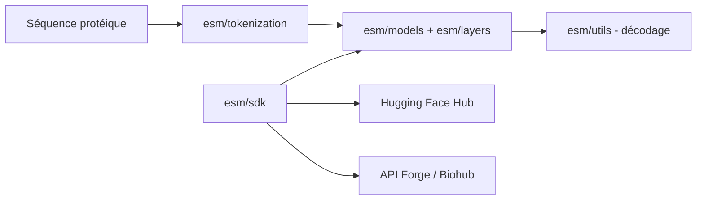

# evolutionaryscale/esm

> Modèles de langage et de repliement de protéines (ESMC, ESMFold2, SAE) pour chercheurs en biologie computationnelle.

## Le problème
Prédire la structure d'une protéine, ou en extraire des représentations, exige des modèles lourds et difficiles à faire tourner soi-même.

## Ce que ça fait vraiment
Le paquet contient les couches, les modèles et les tokenizers d'ESMC (modèle de langage) et d'ESMFold2 (repliement all-atom, avec ligands et ADN). Des autoencodeurs épars (SAE) sur ESMC exposent des caractéristiques interprétables. Deux voies : poids Hugging Face en local sur GPU, ou API distante Biohub (ex-Forge) via un jeton, avec un exécuteur parallèle pour les lots. Le README annonce aussi le support SageMaker via le SDK.

## Comment c'est branché


## Essayer
```bash
pip install esm
```
Puis le README fournit du code Python : `EsmcForMaskedLM.from_pretrained("biohub/ESMC-6B", device="cuda")` et `EsmFold2Model.from_pretrained("biohub/ESMFold2", device="cuda")`.

## Coût et pièges
GPU nécessaire en local (ROCm 6.4 + PyTorch 2.9 mentionnés pour AMD). Via l'API : jeton à créer sur Biohub, garde-fous sur les séquences de pathogènes. Politique d'usage acceptable à respecter.

## Ce que ce n'est pas
Pas un outil clé en main pour non-biologistes. La licence est présente mais non identifiée par GitHub : à lire avant tout usage commercial. Les résultats de conception de binders ne sont validés qu'au labo, pas par le dépôt.

## Alternatives
Transformers de Hugging Face (ESMC et ESMFold2 y sont disponibles, pile de dépendances différente, plus simple à essayer).

## Pour toi
À surveiller : très pertinent si tu fais du ML sur protéines, mais lourd en GPU et la licence reste à vérifier.

