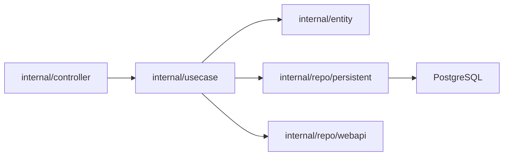

# evrone/go-clean-template

> Gabarit de microservice Go en Clean Architecture, avec REST, gRPC, AMQP et NATS.

## Le problème
Un service qui grossit tourne vite au code spaghetti sans règles de découpage claires.

## Ce que ça fait vraiment
Trois domaines d'exemple (authentification JWT, tâches, traduction) exposés par quatre transports : REST (Fiber), gRPC, RabbitMQ RPC, NATS RPC. Injection de dépendances par constructeurs, Postgres, traces OpenTelemetry vers Jaeger. Couches `controller`, `usecase`, `entity`, `repo`.

## Comment c'est branché


## Essayer
```bash
make compose-up
make run
make compose-up-integration-test
make compose-up-all
```

## Coût et pièges
Gratuit ; nécessite Docker, Postgres, RabbitMQ et NATS. Identifiants d'exemple en clair dans le README : à changer.

## Ce que ce n'est pas
Pas une bibliothèque à importer : c'est un modèle à copier et adapter.

## Alternatives
bxcodec/go-clean-arch et zhashkevych/courses-backend, cités dans le README.

## Pour toi
Ignorer : gabarit de backend Go généraliste, peu lié à data/IA/MLOps.

