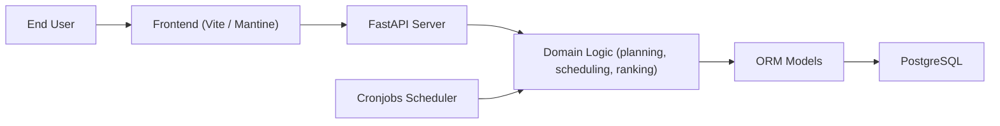

# evroon/bracket

> Application web autohébergée pour organiser des tournois (élimination, round-robin, suisse).

## Le problème
Organiser un tournoi avec plusieurs phases, terrains et équipes demande un outil de planification, pas un tableur.

## Ce que ça fait vraiment
Backend FastAPI asynchrone avec PostgreSQL, frontend Vite/Mantine (le diagramme parle de Next.js). Gère élimination directe, round-robin et suisse (planification automatique), étapes multiples, glisser-déposer des matchs sur des terrains, équipes, clubs, tableaux de bord publics avec logo. Tâches planifiées (planning, suppression des données de démo).

## Comment c'est branché


## Essayer
```bash
git clone git@github.com:evroon/bracket.git
cd bracket
sudo docker compose up -d
docker exec bracket-backend uv run --no-dev ./cli.py create-dev-db
```

## Coût et pièges
Gratuit, Docker Compose démarre backend, frontend et Postgres. Le README affiche un identifiant de démo avec mot de passe : à changer avant toute exposition.

## Ce que ce n'est pas
Pas un outil data ni IA. Licence AGPL-3.0 : obligations si tu l'héberges pour des tiers.

## Alternatives
Aucune alternative nommée dans le README.

## Pour toi
À ignorer pour un profil data/IA : sans lien avec ton métier, même s'il paraît propre et simple à lancer.
