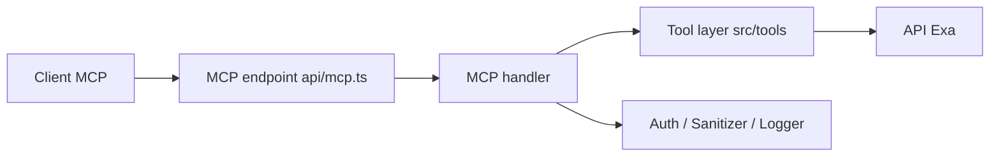

# exa-labs/exa-mcp-server

> Serveur MCP donnant à des agents IA la recherche web et la lecture de pages via l'API Exa.

## Le problème
Les agents ont besoin de résultats web propres et lisibles, sans écrire leur propre passerelle de recherche.

## Ce que ça fait vraiment
Un serveur MCP hébergé (`https://mcp.exa.ai/mcp`) expose `web_search_exa` et `web_fetch_exa` par défaut, plus `web_search_advanced_exa` et `agent_run` en option. Le dépôt sert aussi de plugin d'agent et contient des skills (`search`, `exa-agent`). D'après le code : fonctions Vercel, points d'accès OAuth et outils de recherche de code, entreprises, personnes.

## Comment c'est branché


## Essayer
```bash
claude plugin install exa@claude-plugins-official
codex mcp add exa --url https://mcp.exa.ai/mcp
```

## Coût et pièges
Anonyme avec limites de débit ; clé d'API ou OAuth pour plus de quota et pour Exa Agent. Le service est hébergé chez Exa : requêtes envoyées à un tiers.

## Ce que ce n'est pas
Ce n'est pas un moteur de recherche autonome : le dépôt est un connecteur vers un service payant ; les skills sont de la documentation, pas du code d'exécution.

## Alternatives
Le README ne nomme aucune alternative.

## Pour toi
À surveiller : connexion rapide de la recherche web à tes agents, mais dépendance à un SaaS et à ses quotas.
