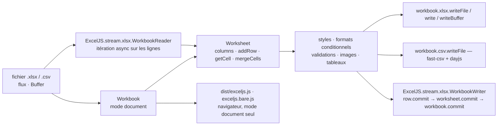

# exceljs/exceljs

> **Read and write XLSX and CSV workbooks from Node or a browser, styles included.**

## The problem

Producing an Excel file from a Node service is not writing a CSV and renaming it `.xlsx`: there
is the zip container, the worksheet XML, the shared strings table, the style description, the
number formats. The other way round, reading a workbook handed over by a business team means
taking that same stack apart. The README states the method plainly: the format was
"reverse engineered from Excel spreadsheet files".

## What it actually does

ExcelJS exposes a `Workbook` object you fill in memory — sheets, typed columns with
`header`/`key`/`width`, rows added by object, contiguous array or sparse array, cells addressed
by reference (`worksheet.getCell('A1')`) — then serialise to XLSX or CSV, into a file, a stream
or a `Buffer`. The same object loads from an existing file.

The surface goes well beyond values: styles (font, alignment, borders, fills, number formats,
rich text, cell protection), merged cells, conditional formatting (expression, top 10, colour
scale, icon set, data bars, time periods), data validations, cell comments, tables, defined
names, auto filters, outline levels, images (as background, over a range, in a cell, with a
hyperlink), page setup and headers/footers, frozen or split views, sheet protection. Cell values
have their own types: number, string, date, hyperlink, formula — including shared and array
formulas — rich text, boolean, error.

Two I/O modes coexist: the document mode, which builds the whole workbook in memory, and a
streaming mode (`ExcelJS.stream.xlsx.WorkbookWriter` / `WorkbookReader`) where rows are
`commit()`ed as they go and then freed, for volumes memory cannot hold. CSV relies on fast-csv
for parsing and dayjs for dates.

## How it is wired



No code-derived diagram exists for this repository: this one is rebuilt from the README alone.
The thing to notice is the fork on the output side — document mode and streaming mode share the
row, cell and style objects but not their lifecycle: in the latter a committed row is no longer
reachable, and the browser only gets the former.

## Trying it

```shell
npm install exceljs
```

```javascript
const ExcelJS = require('exceljs');

const workbook = new ExcelJS.Workbook();
const sheet = workbook.addWorksheet('My Sheet');

worksheet.columns = [
  { header: 'Id', key: 'id', width: 10 },
  { header: 'Name', key: 'name', width: 32 },
  { header: 'D.O.B.', key: 'DOB', width: 10, outlineLevel: 1 }
];

worksheet.addRow({id: 1, name: 'John Doe', dob: new Date(1970,1,1)});

await workbook.xlsx.writeFile(filename);
```

Reading back, and the streaming variant for large volumes:

```javascript
const workbook = new Excel.Workbook();
await workbook.xlsx.readFile(filename);
```

```javascript
const options = {
  filename: './streamed-workbook.xlsx',
  useStyles: true,
  useSharedStrings: true
};
const workbook = new Excel.stream.xlsx.WorkbookWriter(options);
```

```js
const workbookReader = new ExcelJS.stream.xlsx.WorkbookReader('./file.xlsx');
for await (const worksheetReader of workbookReader) {
  for await (const row of worksheetReader) {
    // ...
  }
}
```

## Cost and traps

- **Nothing to pay, no account to open**: one `npm install`, MIT licence, no key, no third-party
  service.
- **Memory is the real cost.** The README says so directly: document mode builds the entire
  workbook in memory, which "can limit the size of the document". Past that, streaming mode is
  the only way, with its constraints.
- **Streaming constraints**: once a worksheet is added it cannot be removed, once a row is
  committed it is no longer accessible, and `unMergeCells()` is not supported. Committing is
  manual — a row is not freed on add, precisely so cells can be merged across rows.
- **Expensive streaming options**: `useStyles` and `useSharedStrings` default to `false`; the
  README notes styles "can add some performance overhead".
- **ES5 and old browsers**: the `exceljs/dist/es5` path has an implicit dependency on polyfills
  that are no longer shipped — `core-js` and `regenerator-runtime` must be added by hand, plus a
  unicode regex polyfill for IE 11.
- **The `dist/` folder is not a contract**: only the browserified bundle, its minified version
  and the `package.json` `main` are guaranteed; the rest may move.
- **Two known bugs acknowledged in the README**: a `splice` affecting a merged cell will not move
  the merge group correctly, and the Puppeteer browser test misbehaves under the Windows Linux
  subsystem (disabled by a `.disable-test-browser` file).
- **Visible third-party dependencies**: fast-csv for CSV parsing, dayjs for dates, archiver for
  the zip. Their options leak into the API (`parserOptions`, `dateFormats`, `zip`).

## What it is not

- **It is not Excel.** There is no calculation engine: a formula is stored as formula text and,
  optionally, a result you supply yourself. The file opens in Excel, it does not evaluate in Node.
- **It is not a complete browser library**: the README explicitly isolates the client-side usable
  part, and the streaming reader and writer are excluded from it. Only document mode ships.
- **It is not full coverage of the format**: pivot tables arrived through a contribution "with
  limitations", and a long release history lists regressions on themes, colours and conditional
  formatting. A complex workbook read and written back does not necessarily come out identical.
- **It is not an `.xls` or OpenDocument reader**: XLSX and CSV, nothing else.
- **Columns are not a schema**: the README warns that the `worksheet.columns` structure is a
  workbook-building convenience and is not fully persisted, column width aside.

## Alternatives

| | When to prefer it |
|---|---|
| **fast-csv** | Named in the README as the CSV parsing engine behind ExcelJS. Prefer it directly if the need stops at CSV: no styles, no zip, no in-memory workbook. |
| **parallax/jsPDF** | A catalogue neighbour, comparable only in intent — generating an office document from JavaScript. Prefer it when the expected output is a fixed PDF rather than a spreadsheet the recipient will reopen and edit. |

The other suggested neighbours (`avelino/awesome-go`, `opendatalab/MinerU`,
`AtsushiSakai/PythonRobotics`) are not comparable: a Go link list, a Python PDF document
extractor and a robotics algorithm collection do not write workbooks.

## For you

This is the export brick you always end up having to write when a data pipeline must hand its
results to people who work in Excel — and "handing it to Excel" means wide columns, bold headers,
number formats and tabs, not a CSV. Streaming mode makes it usable on large extractions, and
async-iteration reading also turns it into an ingester for workbooks supplied by the business.
Set it aside if your chain is Python: bringing in a Node runtime just for export has a price, and
the README offers no binding outside JavaScript.
