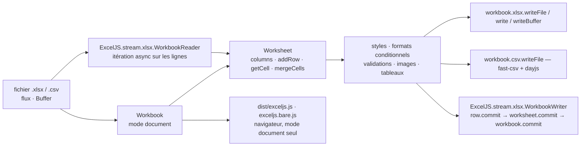

# exceljs/exceljs

> **Lire et écrire des classeurs XLSX et CSV depuis Node ou un navigateur, styles compris.**

## Le problème

Produire un fichier Excel depuis un service Node, ce n'est pas écrire un CSV renommé en `.xlsx` :
il faut le conteneur zip, les feuilles de calcul XML, la table de chaînes partagées, la
description des styles, les formats de nombre. Et dans l'autre sens, relire un classeur fourni
par un métier suppose de démonter le même empilement. Le README annonce d'ailleurs la méthode :
le format a été « reverse engineered from Excel spreadsheet files ».

## Ce que ça fait vraiment

ExcelJS expose un objet `Workbook` qu'on remplit en mémoire — feuilles, colonnes typées avec
`header`/`key`/`width`, lignes ajoutées par objet, tableau contigu ou tableau creux, cellules
adressées par référence (`worksheet.getCell('A1')`) — puis qu'on sérialise vers XLSX ou CSV,
dans un fichier, un flux ou un `Buffer`. Le même objet se charge depuis un fichier existant.

La surface couverte dépasse les valeurs : styles (police, alignement, bordures, remplissages,
formats de nombre, texte riche, protection de cellule), fusion de cellules, mise en forme
conditionnelle (expression, top 10, échelle de couleurs, jeu d'icônes, barres de données,
périodes), validations de données, commentaires de cellule, tableaux, plages nommées, filtres
automatiques, niveaux de plan, images (en fond, sur une plage, dans une cellule, avec lien),
mise en page et en-têtes/pieds, vues figées ou scindées, protection de feuille. Les valeurs de
cellule ont leurs types propres : nombre, chaîne, date, lien hypertexte, formule — y compris
formule partagée et formule matricielle —, texte riche, booléen, erreur.

Deux modes d'entrée-sortie coexistent : le mode document, qui construit tout le classeur en
mémoire, et un mode flux (`ExcelJS.stream.xlsx.WorkbookWriter` / `WorkbookReader`) où les
lignes sont `commit()`ées au fil de l'eau et libérées, pour les volumes que la mémoire ne
tient pas. Le CSV s'appuie sur fast-csv pour l'analyse et sur dayjs pour les dates.

## Comment c'est branché



Aucun diagramme tiré du code n'existe pour ce dépôt : ce schéma est reconstruit depuis le seul
README. Le point à retenir est la fourche en sortie — le mode document et le mode flux
partagent les objets ligne, cellule et style, mais pas le cycle de vie : dans le second, une
ligne validée n'est plus accessible, et le navigateur n'a droit qu'au premier.

## Essayer

```shell
npm install exceljs
```

```javascript
const ExcelJS = require('exceljs');

const workbook = new ExcelJS.Workbook();
const sheet = workbook.addWorksheet('My Sheet');

worksheet.columns = [
  { header: 'Id', key: 'id', width: 10 },
  { header: 'Name', key: 'name', width: 32 },
  { header: 'D.O.B.', key: 'DOB', width: 10, outlineLevel: 1 }
];

worksheet.addRow({id: 1, name: 'John Doe', dob: new Date(1970,1,1)});

await workbook.xlsx.writeFile(filename);
```

Relecture, et version flux pour les gros volumes :

```javascript
const workbook = new Excel.Workbook();
await workbook.xlsx.readFile(filename);
```

```javascript
const options = {
  filename: './streamed-workbook.xlsx',
  useStyles: true,
  useSharedStrings: true
};
const workbook = new Excel.stream.xlsx.WorkbookWriter(options);
```

```js
const workbookReader = new ExcelJS.stream.xlsx.WorkbookReader('./file.xlsx');
for await (const worksheetReader of workbookReader) {
  for await (const row of worksheetReader) {
    // ...
  }
}
```

## Coût et pièges

- **Rien à payer, rien à créer** : un `npm install`, licence MIT, aucune clé, aucun service tiers.
- **La mémoire est le vrai coût.** Le README le dit sans détour : le mode document construit le
  classeur entier en mémoire, ce qui « can limit the size of the document ». Au-delà, il faut
  passer au mode flux et accepter ses contraintes.
- **Contraintes du mode flux** : une feuille ajoutée ne peut plus être retirée, une ligne
  validée n'est plus accessible, `unMergeCells()` n'est pas pris en charge. Et le `commit()`
  est manuel — une ligne n'est pas libérée à l'ajout, justement pour autoriser les fusions à
  cheval sur plusieurs lignes.
- **Options de flux coûteuses** : `useStyles` et `useSharedStrings` valent `false` par défaut ;
  le README note que les styles « can add some performance overhead ».
- **ES5 et vieux navigateurs** : le chemin `exceljs/dist/es5` a une dépendance implicite à des
  polyfills qui ne sont plus fournis — `core-js` et `regenerator-runtime` à ajouter soi-même,
  plus un polyfill de regex unicode pour IE 11.
- **Le dossier `dist/` n'est pas un contrat** : seuls le bundle browserifié, sa version minifiée
  et le `main` du `package.json` sont garantis ; le reste peut bouger.
- **Deux bogues connus assumés** dans le README : un `splice` qui touche une cellule fusionnée ne
  déplace pas correctement le groupe de fusion, et le test navigateur Puppeteer se comporte mal
  sous le sous-système Linux de Windows (désactivable par un fichier `.disable-test-browser`).
- **Dépendances tierces visibles** : fast-csv pour l'analyse CSV, dayjs pour les dates, archiver
  pour le zip. Leurs options fuient dans l'API (`parserOptions`, `dateFormats`, `zip`).

## Ce que ce n'est pas

- **Ce n'est pas Excel.** Aucun moteur de calcul : une formule est stockée comme texte de
  formule et, éventuellement, comme résultat que l'on fournit soi-même. Le fichier s'ouvre dans
  Excel, il ne s'évalue pas dans Node.
- **Ce n'est pas une bibliothèque navigateur complète** : le README isole explicitement la part
  utilisable côté client, et lecteur et écrivain en flux en sont exclus. Seul le mode document
  passe.
- **Ce n'est pas une couverture intégrale du format** : les tableaux croisés dynamiques sont
  arrivés par contribution « with limitations », et un historique de versions long recense des
  régressions sur les thèmes, les couleurs et la mise en forme conditionnelle. Un classeur
  complexe relu puis réécrit ne revient pas forcément à l'identique.
- **Ce n'est pas un lecteur de `.xls` ni de OpenDocument** : XLSX et CSV, rien d'autre.
- **Les colonnes ne sont pas un schéma** : le README prévient que la structure `worksheet.columns`
  est une commodité de construction et n'est pas réellement persistée, largeur mise à part.

## Alternatives

| | Quand le préférer |
|---|---|
| **fast-csv** | Nommée dans le README comme le moteur d'analyse CSV d'ExcelJS. À préférer directement si le besoin s'arrête au CSV : pas de styles, pas de zip, pas de classeur en mémoire. |
| **parallax/jsPDF** | Voisin du catalogue, comparable seulement par l'intention — générer un document bureautique depuis JavaScript. À préférer quand la sortie attendue est un PDF figé plutôt qu'un tableur que le destinataire va rouvrir et modifier. |

Les autres voisins proposés (`avelino/awesome-go`, `opendatalab/MinerU`,
`AtsushiSakai/PythonRobotics`) ne sont pas comparables : une liste de liens Go, un extracteur de
documents PDF en Python et une collection d'algorithmes de robotique n'écrivent pas de classeur.

## Pour toi

C'est la brique d'export qu'on finit toujours par devoir écrire quand un pipeline data doit
rendre ses résultats à des gens qui travaillent dans Excel — et « rendre à Excel » veut dire
colonnes larges, en-têtes en gras, formats de nombre et onglets, pas un CSV. Le mode flux la
rend utilisable sur des extractions volumineuses, et la lecture en itération asynchrone en fait
aussi un ingesteur de classeurs fournis par le métier. À écarter si ta chaîne est en
Python : introduire un runtime Node juste pour l'export se paie, et le README ne propose aucun
binding hors JavaScript.
