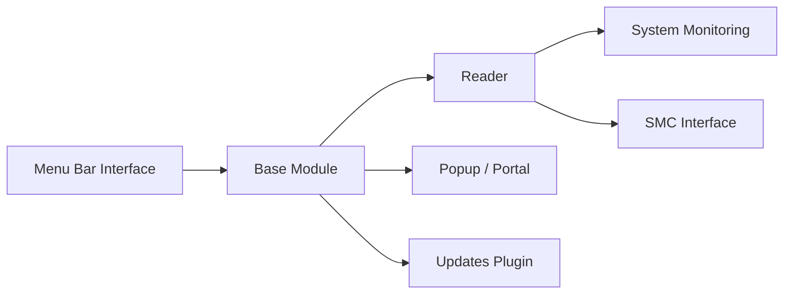

# exelban/stats

> Moniteur système dans la barre de menus de macOS 12+, pour utilisateurs de Mac.

## Le problème
Surveiller CPU, mémoire ou réseau sur un Mac oblige à ouvrir l'Activity Monitor à chaque fois.

## Ce que ça fait vraiment
Modules dans la barre de menus : CPU, GPU, mémoire, disque, réseau, batterie, capteurs (température, tension, puissance), Bluetooth, horloge multi-fuseaux, et contrôle des ventilateurs (plus maintenu). Chaque module a son lecteur, ses réglages, sa notification et son popup. Le README dit ne collecter aucune télémétrie ; les seules requêtes externes servent aux mises à jour et à l'IP publique.

## Comment c'est branché


## Essayer
```bash
brew install stats
sh /Applications/Stats.app/Contents/Resources/Scripts/uninstall.sh
```

## Coût et pièges
Gratuit. Les modules Capteurs et Bluetooth consomment le plus. Sous macOS 26, il faut autoriser Stats dans Réglages > Barre des menus. Un assistant SMC privilégié est installé (retiré par le script de désinstallation).

## Ce que ce n'est pas
Pas un outil de supervision serveur ni d'alerting. Le projet est ouvert en lecture mais pas en contribution : les demandes de fusion non sollicitées sont refusées.

## Alternatives
- Aucune alternative nommée dans le README.

## Pour toi
Adopter si tu travailles sur Mac : il montre charge GPU, mémoire et températures pendant un entraînement local, sans télémétrie déclarée, mais dépend d'une seule personne.

