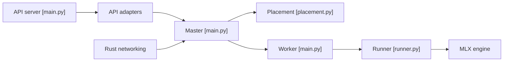

# exo-explore/exo

> Relie plusieurs appareils en grappe pour exécuter localement de gros modèles d'IA, surtout sur Mac.

## Le problème
Un modèle de plusieurs centaines de milliards de paramètres ne tient pas dans la mémoire d'une seule machine.

## Ce que ça fait vraiment
Les appareils se découvrent automatiquement. Un maître calcule le placement selon la topologie (mémoire, latence, bande passante) et les workers exécutent l'inférence avec MLX, en parallélisme de pipeline ou de tenseurs. API compatibles OpenAI Chat Completions, Claude Messages, OpenAI Responses et Ollama, plus un tableau de bord. Linux : CPU seulement pour l'instant.

## Comment c'est branché


## Essayer
```bash
nix run .#exo
git clone https://github.com/exo-explore/exo
cd exo/dashboard && npm install && npm run build && cd ..
uv sync --extra mlx
uv run exo
brew install --cask exo
```
Tableau de bord et API sur http://localhost:52415.

## Coût et pièges
Prérequis lourds : Xcode, Rust nightly, Node, uv, macmon. La RDMA demande macOS 26.2, Thunderbolt 5, un câble compatible et une activation en mode Recovery. Les versions de macOS doivent être identiques partout. Les gains annoncés (1,8× sur 2 appareils, 3,2× sur 4) sont ceux du README.

## Ce que ce n'est pas
Ce n'est pas un service hébergé ni un serveur multi-GPU Linux. Les benchmarks affichés viennent d'une source tierce.

## Alternatives
- Ollama (API compatible, citée) : plus simple sur une seule machine.

## Pour toi
À surveiller : pertinent si tu as plusieurs Mac récents pour tester de gros LLM en local, sinon le support Linux reste limité au CPU.

