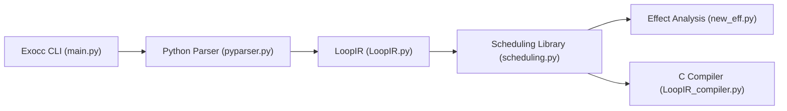

# exo-lang/exo

> Compilateur en Python qui planifie des boucles tensorielles et génère du C pour accélérateurs matériels.

## Le problème
Écrire à la main des noyaux optimisés pour chaque accélérateur est long et fragile ; les optimisations sont mêlées à l'algorithme.

## Ce que ça fait vraiment
On écrit une procédure en Python, on la transforme par des opérations de planification (scheduling API, curseurs), puis `exocc` génère un fichier C et un en-tête. Analyses d'effets et de plages, modèles mémoire, plates-formes Gemmini, NEON et x86. Deux articles (PLDI 2022, ASPLOS 2025) décrivent la conception.

## Comment c'est branché


## Essayer
```bash
pip install exo-lang
python exo_file.py
exocc exo_file.py
pytest
```

## Coût et pièges
Gratuit. Python 3.9+ ; PySMT et un solveur (z3 fourni) peuvent poser problème ; tests : CMake 3.21+, SDE optionnel pour AMX/AVX-512. 130 issues ouvertes.

## Ce que ce n'est pas
Pas un framework de deep learning : c'est un compilateur de noyaux pour qui sait planifier des boucles.

## Alternatives
Aucune alternative nommée dans le README.

## Pour toi
À surveiller : pertinent si tu écris des noyaux pour accélérateurs, sans utilité pour de la data science courante.

