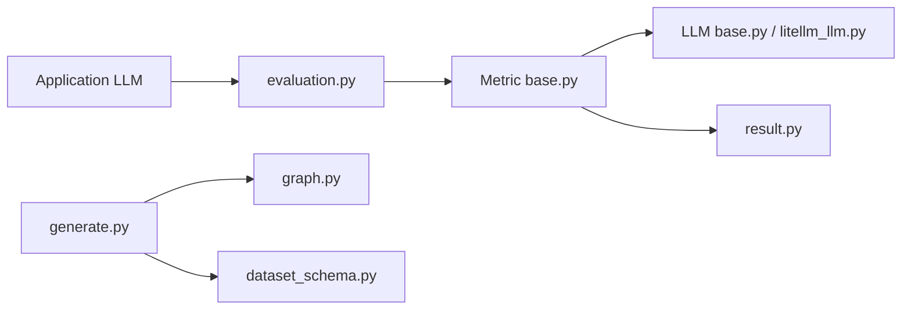

# explodinggradients/ragas

> Bibliothèque Python qui note la qualité d'applications LLM (RAG surtout) et génère des jeux de test.

## Le problème
Évaluer une application LLM à la main est lent et subjectif ; sans jeu de test, on n'a rien à comparer d'une version à l'autre.

## Ce que ça fait vraiment
Fournit des métriques (à base de LLM ou classiques) comme `DiscreteMetric`, qui appellent un LLM juge pour noter une réponse. Génère un jeu de test à partir d'un graphe de connaissances et de synthétiseurs de questions. Propose des intégrations (LangChain, observabilité) et un mode « retour de production ». Un gabarit `rag_eval` est créé par `ragas quickstart`.

## Comment c'est branché


## Essayer
```bash
pip install ragas
ragas quickstart
ragas quickstart rag_eval -o ./my-project
```

## Coût et pièges
Chaque note appelle un LLM : clé d'API (le README suppose `OPENAI_API_KEY`) et facture à ta charge. Collecte d'usage anonymisée, désactivable via `RAGAS_DO_NOT_TRACK=true`.

## Ce que ce n'est pas
Pas une plateforme d'observabilité. Les gabarits `agent_evals`, `benchmark_llm`, `prompt_evals`, `workflow_eval` sont « bientôt ». La note dépend du LLM juge choisi. 619 issues ouvertes.

## Alternatives
Aucune alternative nommée dans le README.

## Pour toi
À adopter pour mesurer un RAG de façon reproductible : Apache-2.0, dernier push février 2026, mais budgète le coût du LLM juge et coupe la télémétrie.

