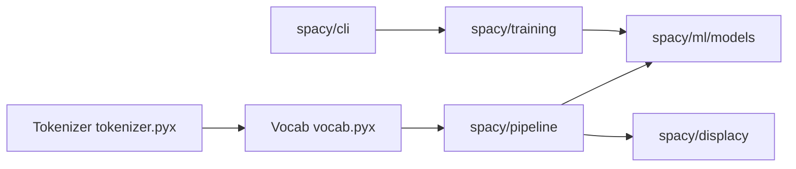

# explosion/spaCy

> Bibliothèque Python/Cython de traitement du langage, avec pipelines pré-entraînés, pour la production.

## Le problème
Tokeniser, étiqueter, parser et extraire des entités sur de gros volumes demande des composants rapides, cohérents et entraînables.

## Ce que ça fait vraiment
Tokenisation pour 70+ langues, pipelines entraînés : POS, dépendances, NER, classification, lemmatisation, liaison d'entités.
Système d'entraînement configuré par fichier, transformers (BERT), modèles PyTorch/TensorFlow personnalisés.
Modèles distribués comme paquets Python ; visualiseurs syntaxe/NER ; intégration de LLM dans les pipelines.
Maintenu par Explosion (société), MIT.

## Comment c'est branché
Diagramme non fourni (aucun composant lisible). D'après l'architecture décrite :


## Essayer
```bash
pip install -U pip setuptools wheel
pip install spacy
python -m spacy download en_core_web_sm
python -m spacy validate
```

## Coût et pièges
Gratuit. Python 3.7 à 3.12 (64 bits) ; compilation depuis les sources délicate (compilateur). Réentraîner ses modèles après mise à jour.

## Ce que ce n'est pas
Pas un LLM ni un chatbot. Pas de support individuel par e-mail. La compilation source n'est pas le chemin normal.

## Alternatives
Aucune alternative nommée dans le README.

## Pour toi
Standard pour le NLP classique en production : à avoir dans la boîte à outils.
