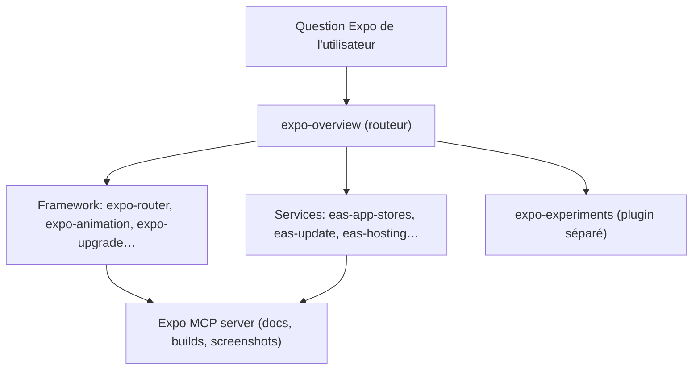

# expo/skills

> Les skills officielles de l'équipe Expo pour agents de code travaillant sur des apps Expo.

## Le problème
Un agent de code qui ne connaît pas les contraintes d'Expo, d'EAS, de React Native, d'iOS et
d'Android produit du code plausible et faux.

## Ce que ça fait vraiment
Fournit une collection de `SKILL.md` groupés en trois familles. « Framework » (open source,
gratuit) couvre la structure de projet, Expo Router, les animations Reanimated, l'UI native,
les design systems, le data fetching, les modules natifs, le brownfield, les upgrades de SDK.
« Services & paid distribution » couvre les briques payantes EAS : builds et soumission aux
stores, hosting, workflows CI/CD, EAS Update et ses métriques, simulateur distant.
« Experimental » contient les API non figées, dans un plugin séparé `expo-experiments`.
Un skill `expo-overview` sert de point d'entrée pour router vers les autres.

## Comment c'est branché


## Essayer
```bash
npx skills@latest add expo/skills --skill '*'
claude plugin install expo@claude-plugins-official
codex plugin add expo@openai-curated
npx skills@latest update
npx skills@latest update expo-router
```

## Coût et pièges
Les skills « Framework » sont gratuites ; celles du groupe Services servent à piloter EAS, qui
est payant — chaque skill de ce groupe s'ouvre sur une note coûts et limites de plan.
Télémétrie d'usage **désactivée par défaut** ; activable (Claude Code seulement) via
`EXPO_SKILLS_TELEMETRY=1`, coupée par `DO_NOT_TRACK=1`, jamais envoyée en CI.

## Ce que ce n'est pas
Ce n'est pas de la documentation : le README dit explicitement que la source de vérité reste
la doc Expo, le CLI Expo et le CLI EAS. Ce n'est pas non plus un serveur MCP — celui-ci est un
projet distinct, simplement empaqueté avec le plugin.

## Alternatives
- Le serveur MCP Expo seul, si tu veux l'accès live aux docs et aux builds sans les skills.

## Pour toi
Sans objet hors développement mobile Expo ; à ignorer pour un profil data / MLOps.
