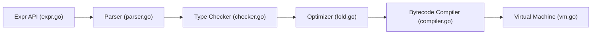

# expr-lang/expr

> Langage d'expressions pour Go, typé statiquement, qui évalue des règles dynamiques en sécurité.

## Le problème
Laisser des utilisateurs écrire des règles (droits, filtres, politiques) sans exécuter de code arbitraire ni figer ces règles dans le binaire.

## Ce que ça fait vraiment
Compile une expression (parseur, vérification de types, optimisation) en bytecode exécuté par une VM, sur un environnement Go fourni. Annoncé sans effet de bord, terminaison garantie et sûr pour la mémoire. Fonctions intégrées (`all`, `filter`, `map`…), débogueur, REPL, génération de documentation de types. Utilisé par Argo, OpenTelemetry Collector, CrowdSec, CoreDNS et d'autres (liste du README).

## Comment c'est branché


## Essayer
```bash
go get github.com/expr-lang/expr
```
```go
program, err := expr.Compile(`sprintf(greet, names[0])`, expr.Env(env))
output, err := expr.Run(program, env)
```

## Coût et pièges
Gratuit. Les garanties de sécurité sont déclarées par le README ; à valider avant d'exposer à des entrées hostiles.

## Ce que ce n'est pas
Pas un langage généraliste : pas de boucles libres, pas d'effets de bord.

## Alternatives
Aucune nommée dans le README.

## Pour toi
À surveiller : utile pour des règles de routage ou de filtrage configurables en Go ; sans intérêt en Python.

