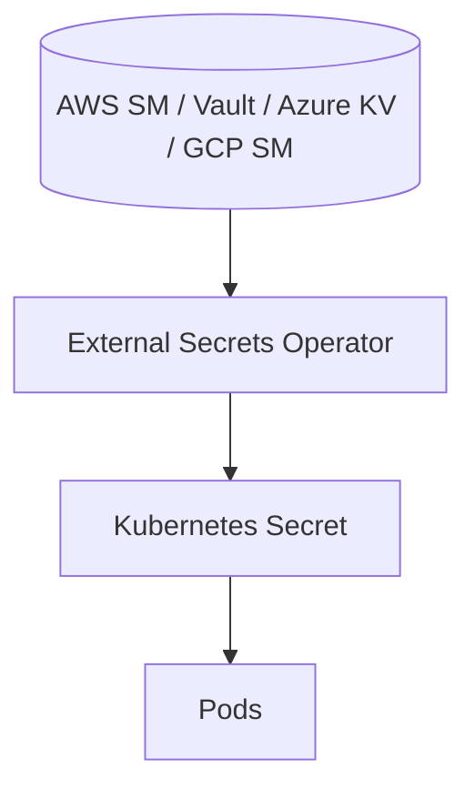

# external-secrets/external-secrets

> Opérateur Kubernetes qui synchronise des secrets externes vers des Secrets Kubernetes natifs.

## Le problème
Les secrets vivent dans AWS Secrets Manager, Vault, Azure Key Vault, etc., mais les workloads Kubernetes attendent des `Secret` natifs. Recopier à la main est fragile et non versionné.

## Ce que ça fait vraiment
L'opérateur lit des API externes (AWS Secrets Manager, HashiCorp Vault, GCP Secret Manager, Azure Key Vault, IBM, Akeyless, CyberArk, Pulumi ESC…) et injecte automatiquement les valeurs dans des Secrets Kubernetes. Projet CNCF fusionnant plusieurs efforts. SBOM et provenance attachés aux releases.

## Comment c'est branché

## Essayer
Aucune commande d'installation présente dans le README (renvoie vers external-secrets.io). L'écrire : voir la documentation officielle.

## Coût et pièges
Gratuit. Dépend d'un gestionnaire de secrets tiers et d'un cluster Kubernetes. Réunion de dev bihebdomadaire CNCF.

## Ce que ce n'est pas
Pas un coffre-fort de secrets : il ne stocke rien, il synchronise depuis un backend existant.

## Alternatives
Non nommées dans le README (liste des backends supportés, pas des concurrents).

## Pour toi
Standard de fait si tes charges ML tournent sur Kubernetes et consomment des secrets cloud ; hors sujet sinon.
