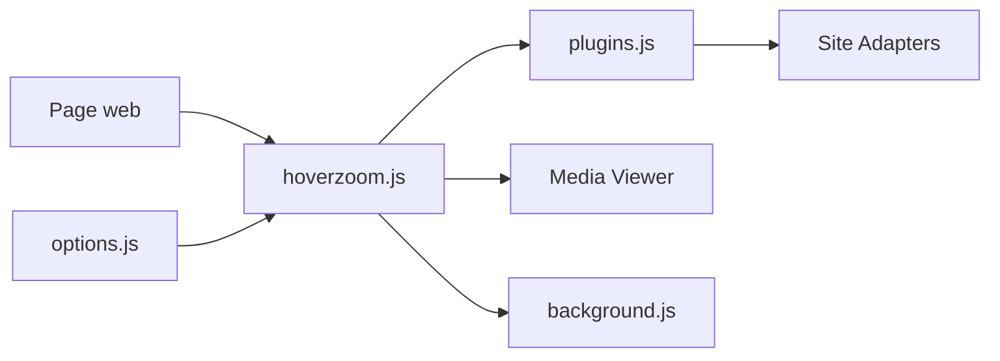

# extesy/hoverzoom

> Extension de navigateur qui agrandit images et vidéos au survol sur les sites pris en charge.

## Le problème
Voir une image en taille réelle sur un site oblige à l'ouvrir dans un nouvel onglet.

## Ce que ça fait vraiment
Au survol d'un média, l'extension résout l'URL pleine taille via des adaptateurs propres à chaque site (dossier `plugins`), l'affiche dans une fenêtre qui tient dans la page, lit les flux vidéo (hls.js) et propose enregistrement ou ouverture. Réglages via options et popup. Version open source d'un HoverZoom supprimé après une prise de contrôle par des logiciels malveillants ; le mainteneur affirme ne collecter aucune donnée.

## Comment c'est branché

## Essayer
Aucune commande documentée dans le README (installation depuis les boutiques Chrome, Firefox, Edge).

## Coût et pièges
Gratuit. Les adaptateurs cassent quand un site change de design ; 244 issues ouvertes.

## Ce que ce n'est pas
Pas un téléchargeur universel. Les promesses de confidentialité restent celles du README.

## Alternatives
Aucune alternative nommée dans le README.

## Pour toi
À ignorer : utilitaire de navigation grand public, sans lien avec ton métier.

