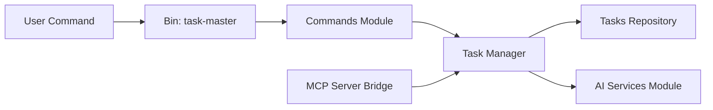

# eyaltoledano/claude-task-master

> Gestionnaire de tâches piloté par LLM, découpant un PRD en tâches pour agents de code.

## Le problème
Un agent de code perd le fil sur un gros projet : sans plan découpé et dépendances, il saute des étapes ou refait le travail.

## Ce que ça fait vraiment
Parse un PRD (`.taskmaster/docs/prd.txt`) en tâches avec dépendances, sous-tâches et tags.
Commandes : `parse-prd`, `list`, `next`, `expand`, `research`, `move` ; utilisable en CLI ou via serveur MCP (36 outils).
Trois modèles configurables (main, research, fallback) chez Anthropic, OpenAI, Perplexity, etc., ou via Claude Code/Codex sans clé.
Chargement sélectif des outils MCP (`TASK_MASTER_TOOLS`) pour limiter le contexte (~21k tokens en mode `all`).

## Comment c'est branché


## Essayer
```bash
npm install -g task-master-ai
task-master init
task-master parse-prd your-prd.txt
task-master next
claude mcp add taskmaster-ai -- npx -y task-master-ai
```

## Coût et pièges
Au moins une clé d'API requise (sauf Claude Code/Codex). Le mode `all` consomme ~21k tokens de contexte.

## Ce que ce n'est pas
Licence MIT + Commons Clause : interdit de le revendre ou de l'offrir en service hébergé. Pas un outil de gestion de projet d'équipe (lien commercial vers Hamster).

## Alternatives
Aucune alternative nommée dans le README.

## Pour toi
Surveiller : utile pour cadrer un agent sur un projet long, mais la clause commerciale et la consommation de contexte en limitent l'intérêt face au plan mode natif de Claude Code.
