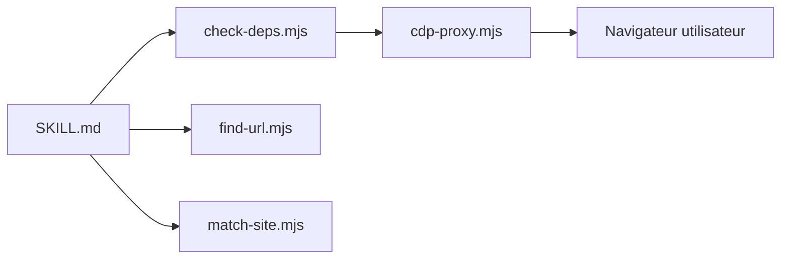

# eze-is/web-access

> Skill pour agents IA qui ajoute stratégie de navigation web et pilotage du navigateur de l'utilisateur via CDP.

## Le problème
WebSearch et WebFetch seuls manquent de stratégie et ne gèrent pas les pages dynamiques ni les sessions connectées.

## Ce que ça fait vraiment
Choisit entre WebSearch, WebFetch, curl, Jina et CDP. Un proxy CDP local (port 3456) pilote Chrome ou Edge avec leurs sessions : ouvrir un onglet, évaluer du JS, cliquer, téléverser, capturer, défiler. Retrouve des pages dans signets et historique (`find-url.mjs`), mémorise des particularités par site, délègue en parallèle à des sous-agents.

## Comment c'est branché


## Essayer
```bash
npx skills add eze-is/web-access
claude plugin marketplace add https://github.com/eze-is/web-access
node "${CLAUDE_SKILL_DIR}/scripts/check-deps.mjs"
```

## Coût et pièges
Node 22+ et débogage à distance activé dans le navigateur. Le proxy a accès à ton navigateur connecté. Le README déconseille ton compte principal sur les réseaux sociaux (risque de blocage). Aucune licence déclarée : droits d'usage incertains.

## Ce que ce n'est pas
Pas un scraper autonome : un guide pour l'agent plus un proxy. Dépôt créé en mars 2026.

## Alternatives
Aucune alternative nommée dans le README.

## Pour toi
À surveiller : utile pour automatiser des recherches avec tes sessions, mais sans licence et avec un accès large à ton navigateur ; isole un profil dédié.

