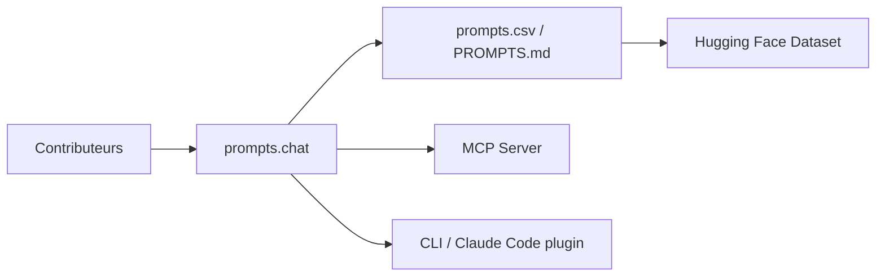

# f/awesome-chatgpt-prompts

> Bibliothèque ouverte de prompts (prompts.chat) pour ChatGPT, Claude, Gemini et autres, avec guide et serveur MCP.

## Le problème
Retrouver de bons prompts de départ pour des rôles et tâches courantes.

## Ce que ça fait vraiment
Collection de prompts, consultable sur prompts.chat, en CSV, en Markdown et sur un jeu de données Hugging Face. Le projet ajoute un livre interactif de prompt engineering (25 chapitres), un jeu pour enfants, un CLI, un plugin Claude Code et un serveur MCP. Auto-hébergement possible avec PostgreSQL.

## Comment c'est branché


## Essayer
```bash
npx prompts.chat
npx prompts.chat new my-prompt-library
```

## Coût et pièges
Gratuit. L'auto-hébergement demande une base PostgreSQL et un assistant de configuration. Les chiffres de popularité du README ne sont pas vérifiés.

## Ce que ce n'est pas
Pas un catalogue de prompts évalués ni un outil d'optimisation. L'architecture fournie (Jekyll) est ancienne par rapport au site actuel.

## Alternatives
- Aucune alternative nommée dans le README.

## Pour toi
À surveiller : source d'inspiration ponctuelle ; pour un travail sérieux, mesure tes prompts sur tes propres cas plutôt que de piocher dans une liste.
