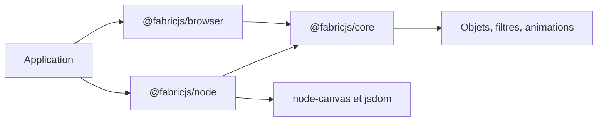

# fabricjs/fabric.js

> Bibliothèque JavaScript pour manipuler un canvas HTML5 : formes, texte, images, interactions et export.

## Le problème
L'API canvas brute ne gère ni objets sélectionnables, ni transformations interactives, ni import/export SVG ou JSON.

## Ce que ça fait vraiment
Modèle objet au-dessus du canvas : déplacer, redimensionner, pivoter, grouper, formes, contrôles, animations, filtres d'image, dégradés, pinceaux, avec import et export JPG, PNG, JSON et SVG. Le code est typé et modulaire. Depuis la v6, les paquets @fabricjs/browser, @fabricjs/node et @fabricjs/core séparent les environnements ; « fabric » reste une façade de compatibilité. Aucun composant lisible dans le graphe fourni : ce qui suit vient du README.

## Comment c'est branché


## Essayer
```bash
npm install @fabricjs/browser
npm install @fabricjs/node
npm install fabric --save
```

## Coût et pièges
Gratuit. Côté Node : node-canvas, avec ses limites et bugs, et Node 20 minimum. Les versions de « fabric » et de tous les @fabricjs/* doivent correspondre, sinon plusieurs runtimes se chargent.

## Ce que ce n'est pas
Ce n'est pas un moteur 3D ni WebGL. Le README signale que @fabricjs/core n'est pas indépendant du DOM.

## Alternatives
- Konva : fonctionnalités similaires.
- PixiJS : rendu WebGL.
- Three.js : graphismes 3D.

## Pour toi
À surveiller : utile pour générer ou annoter des images côté serveur ou dans une interface d'étiquetage, sans rapport direct avec le cœur data/IA.

