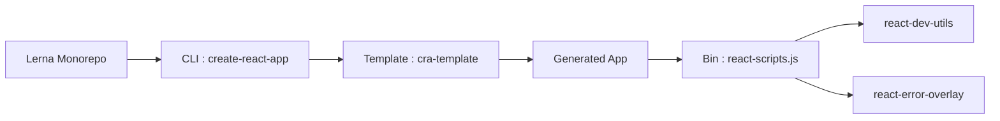

# facebook/create-react-app

> Générateur de projet React monopage avec build préconfiguré, pour développeurs débutants en React.

## Le problème
Configurer webpack, Babel et ESLint pour démarrer une application React est long et fragile.

## Ce que ça fait vraiment
README identique à celui de react/create-react-app. Le graphe d'architecture décrit un monorepo Lerna : le CLI `create-react-app` lit un template (`cra-template`, `cra-template-typescript`), génère l'app, et `react-scripts` pilote webpack, Babel et Jest via `start`, `build`, `test`, `eject`. Le support (`react-dev-utils`, `react-error-overlay`, presets) est à côté ; Docusaurus et les tâches de test forment le reste.

## Comment c'est branché


## Essayer
```bash
npx create-react-app my-app
cd my-app
npm start
```

## Coût et pièges
Gratuit. Dernier push en février 2025 (plus d'un an), 2 411 issues ouvertes. Dépôt identique en apparence à react/create-react-app : ne pas compter deux fois lors du tri.

## Ce que ce n'est pas
Pas un framework : il génère un projet et masque la config. Le README reconnaît que l'outil impose un fonctionnement précis, et que l'éjection oblige à maintenir sa propre configuration.

## Alternatives
- Next.js : pour le rendu serveur et le pré-rendu.
- Gatsby : pour un site surtout statique.
- Neutrino : pour plus de personnalisation.

## Pour toi
À ignorer : outil front-end sans mise à jour depuis plus d'un an, et hors périmètre data/IA/MLOps.

