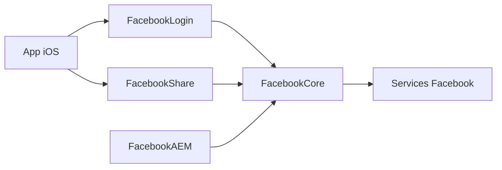

# facebook/facebook-ios-sdk

> SDK Facebook pour apps iOS : connexion, partage, App Links, Graph API et analytics.

## Le problème
Intégrer à la main login Facebook, partage et mesure publicitaire dans une app iOS est long et fragile.

## Ce que ça fait vraiment
Modules Swift/Objective-C : FacebookCore, Login, Share, AEM, GamingServices. S'installe via Swift Package Manager. Envoie des événements d'usage à Facebook ; le README rappelle les obligations de déclaration (iOS 14) et de consentement. Réécriture en Swift en cours, interfaces instables.

## Comment c'est branché


## Essayer
```bash
# README : Xcode > File > Swift Packages > Add Package Dependency, puis l'URL du dépôt
```

## Coût et pièges
Gratuit mais des données d'usage remontent à Facebook ; il faut un compte développeur Facebook, une politique de confidentialité et les déclarations App Store.

## Ce que ce n'est pas
Pas un outil d'IA ni de data. Licence non reconnue par GitHub : à lire avant usage.

## Alternatives
Aucune alternative nommée dans le README.

## Pour toi
Ignorer : SDK mobile lié à l'écosystème Facebook, sans intérêt data/IA/MLOps.

