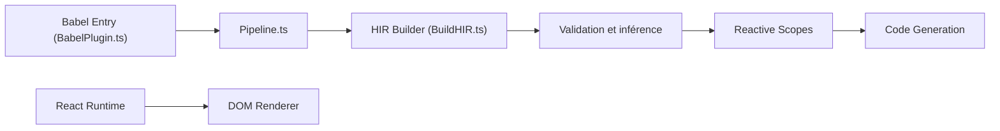

# facebook/react

> Bibliothèque JavaScript pour construire des interfaces à partir de composants, avec un compilateur de mémoïsation associé.

## Le problème
Mettre à jour une interface à la main quand l'état change mène vite à du code difficile à raisonner. On veut déclarer l'interface en fonction de l'état et laisser la bibliothèque calculer les mises à jour.

## Ce que ça fait vraiment
On définit des composants et de l'état, React calcule les mises à jour et un moteur de rendu produit la sortie (navigateur, natif, serveur). Le graphe montre aussi les Server Components, un hook de store externe, DevTools et un compilateur qui passe du code Babel à une représentation HIR, puis à des scopes réactifs et à du code généré. Le README fourni est tronqué : il commence à « Installation », sans introduction ni commande d'installation.

## Comment c'est branché


## Essayer
Extrait du README (exemple JSX), pas de commande d'installation dans la partie fournie :
```bash
# Aucune commande documentée dans le README fourni.
# Le README renvoie à Quick Start et Create a New React App sur le site.
```

## Coût et pièges
Gratuit. Le README ne donne pas ici la commande d'installation ; il faut passer par le site. Le compilateur est décrit comme intégré séparément, avec des chemins de moteur non détaillés dans le graphe.

## Ce que ce n'est pas
Ce n'est pas un framework complet : pas de routage ni de récupération de données décrits dans ce README. Le lien avec le dépôt react/react (même README) n'est pas expliqué.

## Alternatives
Aucune alternative nommée dans le README.

## Pour toi
À ignorer pour un profil data/IA/MLOps sauf si tu construis toi-même un front d'application : la bibliothèque est mûre, mais elle sort du périmètre pipeline et modèles.

