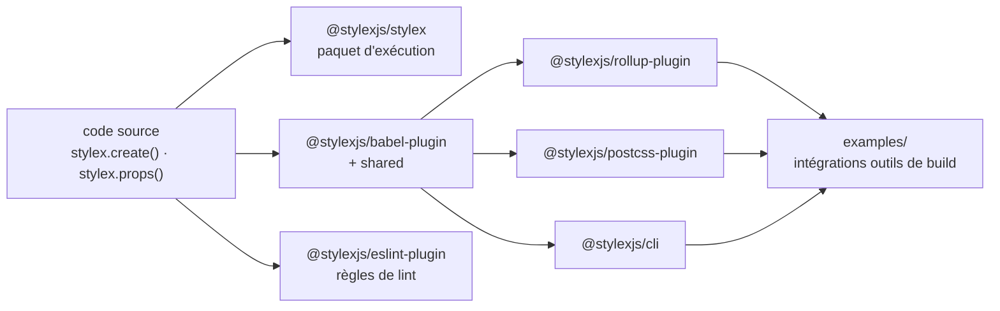

# facebook/stylex

> **Declare UI styles in JavaScript, then let a Babel plugin compile them for the browser.**

## The problem

Without something like this, the styles of a JavaScript interface either live in separate CSS
files that nothing keeps in sync with the components, or in style objects applied at runtime —
which is exactly what the README's stated goal of "optimized user interfaces" pushes against.
The README does not argue the point further: it announces a styling library, not a diagnosis.

## What it actually does

In its own words, StyleX is a JavaScript library for defining styles for optimized user
interfaces. The API the README shows is two functions: `stylex.create({...})`, which declares
a dictionary of styles (`root: { padding: 10 }`, `element: { backgroundColor: 'red' }`), and
`stylex.props(styles.root, styles.element)`, which composes entries and returns the props to
put on the element.

The repository itself is the development monorepo. Under the `@stylexjs` scope it publishes a
runtime package (`stylex`), a `babel-plugin` with its `shared` module, a `cli`, a
`postcss-plugin`, a `rollup-plugin` and an `eslint-plugin`; alongside them sit private
packages `docs`, `benchmarks`, `scripts` and `style-value-parser`, plus an `examples` folder
about integration with build tools. Usage documentation is not in this README — it points to
the `stylexjs.com` site and to each package's own README.

## How it is wired

No code-derived diagram exists for this repository; the graph below only restates the package
list and the example given in the README.



The Babel plugin is the choke point: the Rollup, PostCSS and CLI integrations sit behind it,
and the `stylex` package supplies whatever remains at runtime.

## Trying it

The README gives no install command for a consuming project: the only commands it documents
are for the development monorepo, after cloning it.

```bash
yarn install
yarn build
yarn workspace <package-name> build
yarn test
yarn workspace <package-name> test
```

## Cost and gotchas

MIT licensed, no account, no API key, no third-party service mentioned: the monetary cost is
zero. What you need is Node and Yarn — the README speaks of a "yarn workspace", so Yarn is
assumed for working on the repository. The real cost is elsewhere: StyleX presumes a Babel
build chain, and wiring it into Rollup, PostCSS or the CLI is a separate package each time.
The README quantifies neither the performance implied by "optimized", nor the runtime size,
nor the required Node or Babel versions.

## What it is not

It is not a UI framework or a component library: nothing in the README offers a button, a grid
or a ready-made theme — only a way to declare and compose styles. It is also not a drop-in you
can add without touching the build, since the Babel plugin is central. And this README is not
the documentation: the actual usage material lives off-repo, on `stylexjs.com` and in the
per-package READMEs.

## Alternatives

No comparable alternative in the catalogue. The suggested neighbours are off-topic:
`avelino/awesome-go` and `iptv-org/iptv` are lists, `harry0703/MoneyPrinterTurbo` is a video
generation app, and `microsoft/TypeScript` is a language — none addresses UI styling. The
README names no competitor either.

## For you

Skip it. This is pure front-end tooling, unrelated to a data pipeline, model training or model
serving; it only becomes relevant if you maintain a React interface yourself and accept adding
Babel to your build chain for it.
