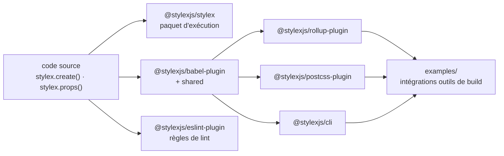

# facebook/stylex

> **Écrire les styles d'une interface en JavaScript, puis les faire compiler en CSS par un plugin Babel.**

## Le problème

Sans outil de ce genre, les styles d'une interface JavaScript vivent soit dans des feuilles
CSS séparées dont rien ne garantit qu'elles correspondent encore aux composants, soit dans des
objets de style appliqués à l'exécution, ce que le README oppose explicitement à son propre
objectif d'interfaces « optimisées ». Le README ne décrit pas plus en détail le mal auquel il
répond : il annonce une bibliothèque de définition de styles, pas un diagnostic.

## Ce que ça fait vraiment

StyleX est, selon sa propre phrase, une bibliothèque JavaScript pour définir les styles
d'interfaces utilisateur optimisées. L'API montrée par le README tient en deux fonctions :
`stylex.create({...})`, qui déclare un dictionnaire de styles (`root: { padding: 10 }`,
`element: { backgroundColor: 'red' }`), et `stylex.props(styles.root, styles.element)`, qui
compose plusieurs entrées et renvoie les propriétés à poser sur l'élément.

Le dépôt lui-même est le monorepo de développement. Il publie sous le préfixe `@stylexjs` un
paquet d'exécution (`stylex`), un `babel-plugin` accompagné d'un module `shared`, un `cli`,
un `postcss-plugin`, un `rollup-plugin` et un `eslint-plugin` ; s'y ajoutent des paquets
privés `docs`, `benchmarks`, `scripts` et `style-value-parser`, plus un dossier `examples`
consacré à l'intégration avec les outils de build. La documentation d'usage n'est pas dans ce
README : elle est renvoyée vers le site `stylexjs.com` et vers les README de chaque paquet.

## Comment c'est branché

Aucun diagramme tiré du code n'existe pour ce dépôt ; le schéma ci-dessous reprend uniquement
la liste des paquets et l'exemple que donne le README.



Le plugin Babel est le point de passage : les intégrations Rollup, PostCSS et CLI se branchent
derrière lui, et le paquet `stylex` fournit ce qui reste à l'exécution.

## Essayer

Le README ne donne aucune commande d'installation pour un projet consommateur : les seules
commandes qu'il documente concernent le monorepo de développement, une fois le dépôt cloné.

```bash
yarn install
yarn build
yarn workspace <package-name> build
yarn test
yarn workspace <package-name> test
```

## Coût et pièges

Licence MIT, aucun compte, aucune clé d'API, aucun service tiers mentionné : le coût
monétaire est nul. Ce qu'il faut avoir, c'est Node et Yarn — le README parle d'un
« yarn workspace », donc l'outillage Yarn est supposé pour le développement du dépôt. Le vrai
coût est ailleurs : StyleX suppose une chaîne de build avec Babel, et l'intégration à Rollup,
PostCSS ou à la CLI est un paquet séparé à câbler. Le README ne chiffre ni les gains de
performance annoncés par le mot « optimisées », ni la taille du runtime, ni les versions de
Node ou de Babel exigées.

## Ce que ce n'est pas

Ce n'est pas un framework d'interface ni une bibliothèque de composants : il n'y a ni bouton,
ni grille, ni thème prêt à l'emploi dans ce que décrit le README, seulement un moyen de
déclarer et de composer des styles. Ce n'est pas non plus un outil qu'on ajoute sans toucher
au build, puisque le plugin Babel est central. Enfin, ce README n'est pas la documentation :
tout l'usage réel est hors dépôt, sur `stylexjs.com` et dans les README des paquets.

## Alternatives

Aucune alternative comparable dans le catalogue. Les voisins proposés sont hors sujet :
`avelino/awesome-go` et `iptv-org/iptv` sont des listes, `harry0703/MoneyPrinterTurbo` une
application de génération de vidéos, et `microsoft/TypeScript` un langage — aucun ne traite
de la définition de styles d'interface. Le README ne nomme par ailleurs aucun concurrent.

## Pour toi

Passe ton chemin. C'est de l'outillage front-end pur, sans rapport avec un pipeline de
données, un entraînement ou une mise en production de modèle ; il ne devient pertinent que si
tu maintiens toi-même une interface React et que tu es prêt à ajouter Babel à ta chaîne de
build pour ça.
