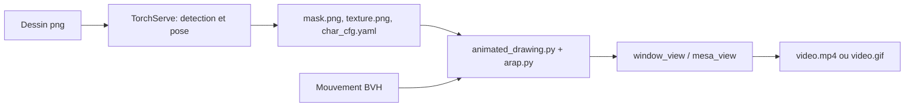

# facebookresearch/AnimatedDrawings

> Anime des dessins d'enfants de figures humaines à partir de données de capture de mouvement, pour chercheurs et créatifs.

## Le problème
Donner vie à un dessin à la main demande d'annoter squelette et masque, puis de le rigger, un travail fastidieux.

## Ce que ça fait vraiment
Implémentation de l'algorithme d'un article de recherche. Un détecteur de silhouette et un estimateur de pose servis par TorchServe produisent masque, texture et fichier de configuration du personnage. Le dessin est déformé par la méthode ARAP à partir de mouvements au format BVH, puis rendu dans une fenêtre, en MP4 ou en GIF transparent. Une interface web permet de corriger les articulations mal placées.

## Comment c'est branché


## Essayer
```bash
conda create --name animated_drawings python=3.8.13
conda activate animated_drawings
git clone https://github.com/facebookresearch/AnimatedDrawings.git
cd AnimatedDrawings
pip install -e .
```
Puis, dans Python : `render.start('./examples/config/mvc/interactive_window_example.yaml')`.

## Coût et pièges
Python 3.8.13 épinglé, testé sur macOS Ventura et Ubuntu 18.04. Le conteneur TorchServe peut demander 16 Go de RAM ; son image met 5 à 7 minutes à se construire. Le jeu de données fait environ 50 Go.

## Ce que ce n'est pas
Dépôt archivé : plus de correctifs. Le modèle de pose suppose un corps humain à deux bras et deux jambes ; les autres squelettes se configurent à la main.

## Alternatives
Aucune alternative nommée dans le README. Une démo web est indiquée pour éviter l'installation (sketch.metademolab.com).

## Pour toi
Ignorer pour l'utiliser : archivé et calé sur Python 3.8. Le jeu Amateur Drawings et les poids MIT peuvent rester utiles à un projet de vision.

