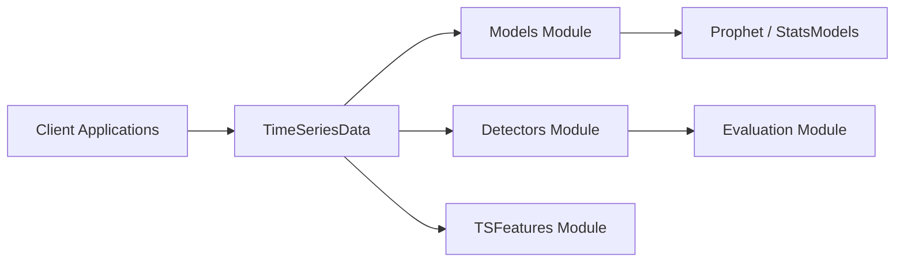

# facebookresearch/Kats

> Boîte à outils Python d'analyse de séries temporelles : prévision, détection, extraction de caractéristiques.

## Le problème
Les analyses de séries temporelles dispersent prévision, détection d'anomalies et features entre plusieurs bibliothèques aux API différentes.

## Ce que ça fait vraiment
Objet commun `TimeSeriesData` sur pandas.
Prévision (Prophet, ARIMA, modèle global neuronal, ensembles, méta-apprentissage pour les hyperparamètres).
Détection de ruptures et d'anomalies (CUSUM, StatSig, DTW…), avec évaluateurs et simulateurs.
`TsFeatures` pour extraire des caractéristiques ; installation minimale possible.

## Comment c'est branché


## Essayer
```bash
pip install --upgrade pip
pip install kats
MINIMAL_KATS=1 pip install kats
```

## Coût et pièges
Gratuit, MIT. Nombreuses dépendances lourdes (Prophet…) ; le mode minimal désactive des fonctions.
Changelog arrêté à la 0.2.0 dans le README.

## Ce que ce n'est pas
Pas un outil de monitoring temps réel.
Pas un framework de deep learning pour séries temporelles récent.

## Alternatives
Aucune alternative nommée dans le README.

## Pour toi
À surveiller : pratique pour la détection de ruptures et les features, mais vérifie la compatibilité des dépendances avant d'en faire un pilier.
